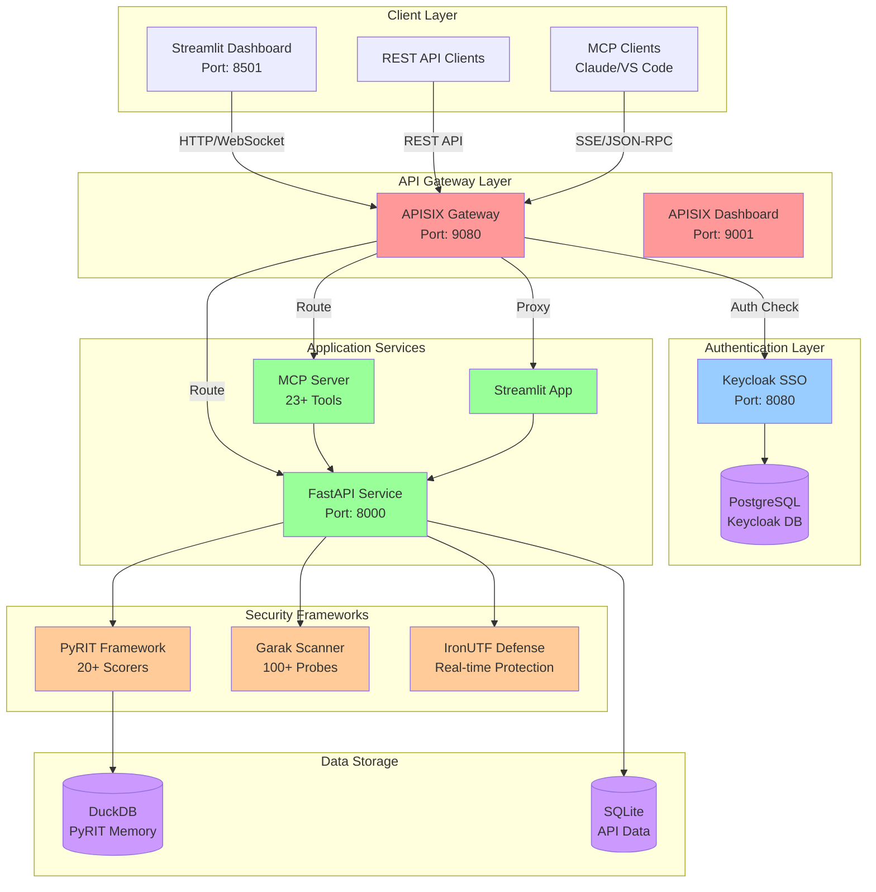
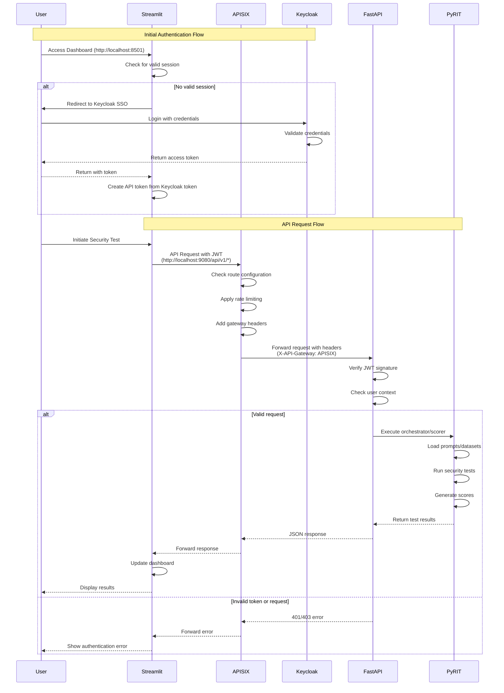

## Status

![CI Status][ci-badge]
![Coverage][coverage-badge]
![Security][security-badge]
![Python][python-badge]
![License][license-badge]

[ci-badge]: https://img.shields.io/github/actions/workflow/status/\
  ViolentUTF/ViolentUTF/ci.yml?branch=main&label=CI
[coverage-badge]: https://img.shields.io/codecov/c/github/\
  ViolentUTF/ViolentUTF?label=coverage
[security-badge]: https://img.shields.io/github/actions/workflow/\
  status/ViolentUTF/ViolentUTF/ci.yml?branch=main&label=security
[python-badge]: https://img.shields.io/badge/\
  python-3.10%20%7C%203.11%20%7C%203.12-blue
[license-badge]: https://img.shields.io/github/license/\
  ViolentUTF/ViolentUTF

# ViolentUTF

> **Enterprise-Grade AI Red-Teaming Platform**

ViolentUTF is a comprehensive AI security testing platform that combines industry-leading frameworks (PyRIT, Garak) with enterprise authentication (Keycloak), API gateway (APISIX), and Model Context Protocol (MCP) integration. Built for security professionals, researchers, and developers who need reliable, scalable AI vulnerability assessment capabilities.

[](LICENSE)
[](https://python.org)
[](https://docker.com)
[](https://modelcontextprotocol.io)

## 🔑 Key Features

### **Security Testing Framework**
- **PyRIT Integration**: Microsoft's Python Risk Identification Toolkit with 20+ built-in scorers
- **Garak LLM Scanner**: Comprehensive vulnerability testing with pre-built datasets
- **Custom Targets**: Specialized PyRIT targets for APISIX AI Gateway integration
- **IronUTF Defense**: Real-time AI endpoint protection and prompt filtering

### **Enterprise Architecture**
- **Keycloak SSO**: Enterprise-grade identity and access management
- **APISIX Gateway**: High-performance API gateway with AI proxy capabilities
- **JWT Authentication**: Secure token-based authentication with automatic refresh
- **Docker Containerization**: Complete containerized deployment with health monitoring

### **Model Context Protocol (MCP)**
- **Production MCP Server**: 23+ specialized tools and 12+ security testing prompts
- **JSON-RPC 2.0**: Full compliance with MCP standard over Server-Sent Events
- **OAuth 2.0 Integration**: Complete OAuth proxy with PKCE support
- **Client-Ready**: Compatible with Claude Desktop, VS Code, and custom applications

### **Developer Experience**
- **Streamlit Interface**: Intuitive web-based security testing dashboard
- **REST API**: Comprehensive FastAPI backend with 20+ endpoints
- **Automated Setup**: Platform-specific setup scripts for macOS, Linux, and Windows
- **Comprehensive Testing**: Full test suite with API and integration tests

## 🚀 Quick Start

### Prerequisites
- **Docker & Docker Compose**: Container orchestration
- **Python 3.9+**: Core runtime environment
- **AI Provider API Keys**: OpenAI, Anthropic, or local models

### Installation

#### macOS
```bash
# Clone repository
git clone https://github.com/cybonto/ViolentUTF.git
cd ViolentUTF

# Configure AI provider keys
cp ai-tokens.env.sample ai-tokens.env
# Edit ai-tokens.env with your API keys

# Run complete setup
./setup_macos_new.sh

# Setup with different verbosity levels
./setup_macos_new.sh --quiet     # Minimal output for automation
./setup_macos_new.sh --verbose   # Detailed setup information
./setup_macos_new.sh --debug     # Full debugging output
./setup_macos_new.sh --help      # Show all options
```

#### Linux
```bash
# Clone and setup
git clone https://github.com/cybonto/ViolentUTF.git
cd ViolentUTF
cp ai-tokens.env.sample ai-tokens.env
# Edit ai-tokens.env with your API keys
./setup_linux.sh
```

#### Windows
```bash
# Clone and setup
git clone https://github.com/cybonto/ViolentUTF.git
cd ViolentUTF
copy ai-tokens.env.sample ai-tokens.env
# Edit ai-tokens.env with your API keys
setup_windows.bat
```

### Setup Verbosity Control

ViolentUTF setup scripts now support multiple verbosity levels to provide the right amount of information for different use cases:

| Verbosity Level | Flag | Use Case | Output Description |
|----------------|------|----------|-------------------|
| **Quiet** | `--quiet` / `-q` | CI/CD, Automation | Errors, warnings, and critical success messages only |
| **Normal** | *(default)* | Interactive Setup | Standard user experience with progress indicators |
| **Verbose** | `--verbose` / `-v` | Troubleshooting | Detailed information and configuration details |
| **Debug** | `--debug` / `-d` | Development | Full debugging output with variable dumps |

#### Examples:
```bash
# Standard interactive setup
./setup_macos_new.sh

# Automated/silent setup for CI/CD
./setup_macos_new.sh --quiet

# Detailed troubleshooting setup
./setup_macos_new.sh --verbose

# Full debugging with all command output
./setup_macos_new.sh --debug

# View all available options
./setup_macos_new.sh --help

# Alternative: Use environment variable
export VUTF_VERBOSITY=2  # 0=quiet, 1=normal, 2=verbose, 3=debug
./setup_macos_new.sh
```

### Access Points

After setup completion:

| Service | URL | Description |
|---------|-----|-------------|
| **Streamlit Dashboard** | http://localhost:8501 | Main security testing interface |
| **REST API** | http://localhost:9080/api/v1 | FastAPI backend endpoints |
| **API Documentation** | http://localhost:9080/docs | Interactive API documentation (Swagger UI) |
| **API ReDoc** | http://localhost:9080/redoc | Alternative API documentation |
| **MCP Server** | http://localhost:9080/mcp/sse | Model Context Protocol endpoint |
| **Keycloak SSO** | http://localhost:8080 | Identity management console |
| **Keycloak (via APISIX)** | http://localhost:9080/auth | SSO login through gateway |
| **APISIX Dashboard** | http://localhost:9001 | API gateway management |
| **AI Proxy Endpoints** | http://localhost:9080/ai/* | Unified AI provider access |

## 🎯 Core Capabilities

### **AI Red-Teaming**
- **Jailbreak Testing**: Comprehensive prompt injection and bypass testing
- **Bias Detection**: AI fairness and bias assessment across multiple dimensions
- **Harmful Content**: Detection of toxic, dangerous, or inappropriate responses
- **Privacy Testing**: Data leakage and PII extraction vulnerability assessment
- **Adversarial Attacks**: Advanced attack pattern testing and defense validation

### **Security Testing Tools**
- **PyRIT Orchestrators**: Automated multi-turn conversation testing
- **Garak Probes**: 100+ vulnerability probes across multiple attack vectors
- **Custom Scorers**: Specialized response evaluation for security contexts
- **Dataset Management**: Pre-built and custom test datasets
- **Report Generation**: Comprehensive security assessment reports

### **Enterprise Integration**
- **SSO Authentication**: Seamless integration with existing identity providers
- **API Gateway**: Centralized access control and rate limiting
- **Audit Logging**: Comprehensive security event logging and monitoring
- **Role-Based Access**: Fine-grained permission control for team environments

## 🏗️ Architecture

ViolentUTF follows a microservices architecture with clear separation of concerns:

### System Architecture



### Request Flow




## 📚 Documentation

Comprehensive documentation is available in the [`docs/`](docs/) directory:

### **Getting Started**
- [**Project Structure**](docs/structure.md) - Complete architecture overview
- [**Setup Guides**](docs/guides/README.md) - Platform-specific installation
- [**Configuration**](docs/mcp/configuration.md) - Environment and service configuration

### **User Guides**
- [**Red-Teaming Guide**](docs/guides/Guide_RedTeaming_GenAIsystems.md) - Security testing methodology
- [**IronUTF Defense**](docs/guides/Guide_IronUTF.md) - AI endpoint protection
- [**PyRIT Scorers**](docs/guides/Guide_Scorers.md) - Response evaluation systems

### **API Documentation**
- [**REST API Reference**](docs/api/README.md) - Complete endpoint documentation
- [**MCP Integration**](docs/mcp/README.md) - Model Context Protocol guide
- [**Authentication**](docs/api/authentication.md) - JWT and OAuth integration

### **Development**
- [**MCP Development**](docs/mcp/development.md) - Extending MCP capabilities
- [**Testing Framework**](tests/README.md) - Comprehensive test suite
- [**Troubleshooting**](docs/troubleshooting/) - Common issues and solutions

## 🔒 Security & Compliance

### **Security Features**
- **Zero-Trust Architecture**: All services require authentication
- **End-to-End Encryption**: TLS/SSL for all external communications
- **JWT Token Security**: Automatic refresh with configurable expiration
- **Rate Limiting**: Protection against abuse and DoS attacks
- **Audit Logging**: Comprehensive security event tracking

### **Compliance Considerations**
- **GDPR Ready**: Privacy controls and data handling procedures
- **SOC 2 Compatible**: Security controls and monitoring
- **Enterprise SSO**: Integration with existing identity providers
- **Role-Based Access**: Fine-grained permission management

### **Responsible AI Testing**
⚠️ **Important**: ViolentUTF provides powerful AI security testing capabilities. Always ensure:
- Proper authorization before testing any systems
- Compliance with your organization's AI testing policies
- Responsible disclosure of discovered vulnerabilities
- Ethical use of red-teaming capabilities

## 🧪 Testing & Validation

### **Automated Testing**
```bash
# Run complete test suite
cd tests && ./run_tests.sh

# API-specific tests
cd tests/api_tests && ./run_api_tests.sh

# MCP integration tests
cd tests/mcp_tests && python -m pytest
```

### **Service Health Checks**
```bash
# Check all services
./check_services.sh

# Verify APISIX routes
cd apisix && ./verify_routes.sh
```

## 🔧 Troubleshooting

### Setup Debugging

If you encounter issues during setup, use different verbosity levels to get more information:

```bash
# For detailed troubleshooting information
./setup_macos_new.sh --verbose

# For full debugging output (includes all command execution)
./setup_macos_new.sh --debug

# Check specific service status
./check_services.sh

# Verify APISIX routes
cd apisix && ./verify_routes.sh
```

### Corporate Proxy / Zscaler SSL Issues

The setup script automatically detects and handles SSL certificate issues. If you encounter SSL errors during setup, you have two options:

#### Automatic Fix (Default)
The setup script will automatically detect SSL issues and apply a workaround. No action needed.

#### Option 1: Add Zscaler Certificates

If you have your Zscaler certificates:

1. Export certificates from your system (see `/docs/guides/zscaler-setup.md`)
2. Copy them to the FastAPI directory:
   ```bash
   cp zscaler.crt violentutf_api/fastapi_app/
   cp CA.crt violentutf_api/fastapi_app/
   ```
3. Use the Zscaler-aware Dockerfile:
   ```bash
   cp violentutf_api/fastapi_app/Dockerfile.zscaler violentutf_api/fastapi_app/Dockerfile
   ./setup_macos.sh
   ```

### Other Common Issues

- **Keycloak Authentication Errors**: See `/docs/troubleshooting/keycloak-password-fix.md`
- **Docker Build Failures**: Ensure Docker Desktop has sufficient resources (8GB RAM minimum)
- **Service Connection Issues**: Run `./check_services.sh` to verify all services are running

For more detailed troubleshooting, see the [Troubleshooting Guide](docs/troubleshooting/).

## 🤝 Contributing

We welcome contributions! Please see our [Contributing Guidelines](CONTRIBUTING.md) for details.

### **Development Setup**
```bash
# Clone repository
git clone https://github.com/cybonto/ViolentUTF.git

# Setup development environment with verbose output
./setup_macos_new.sh --verbose  # or setup_linux.sh/setup_windows.bat

# For debugging setup issues
./setup_macos_new.sh --debug

# Activate Python environment
source .vitutf/bin/activate

# Install development dependencies
pip install -r violentutf/requirements.txt
```

### **Code Quality**
- **Type Checking**: Full mypy compliance
- **Code Formatting**: Black and isort
- **Linting**: flake8 and pylint (Note: F541 f-string warnings are intentionally ignored - see [code style decisions](docs/development/code_style_decisions.md))
- **Testing**: pytest with >90% coverage

## 📄 License

This project is licensed under the MIT License - see the [LICENSE](LICENSE) file for details.

## 🙏 Acknowledgments

ViolentUTF builds upon excellent open-source projects:

- **[PyRIT](https://github.com/Azure/PyRIT)** - Microsoft's Python Risk Identification Toolkit
- **[Garak](https://github.com/leondz/garak)** - LLM vulnerability scanner
- **[APISIX](https://apisix.apache.org/)** - High-performance API gateway
- **[Keycloak](https://www.keycloak.org/)** - Identity and access management
- **[Streamlit](https://streamlit.io/)** - Python web application framework

## 💬 Support

- **Documentation**: [docs/](docs/) directory
- **Issues**: [GitHub Issues](https://github.com/cybonto/ViolentUTF/issues)
- **Discussions**: [GitHub Discussions](https://github.com/cybonto/ViolentUTF/discussions)

---

**ViolentUTF** - Empowering responsible AI security through comprehensive red-teaming capabilities.
