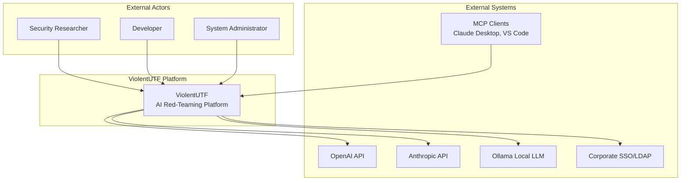
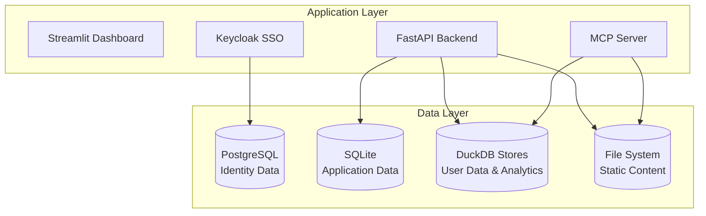
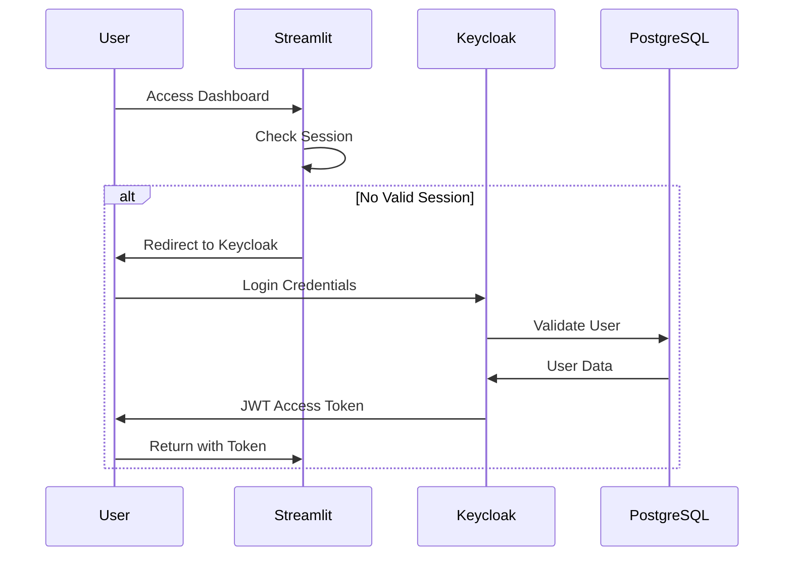
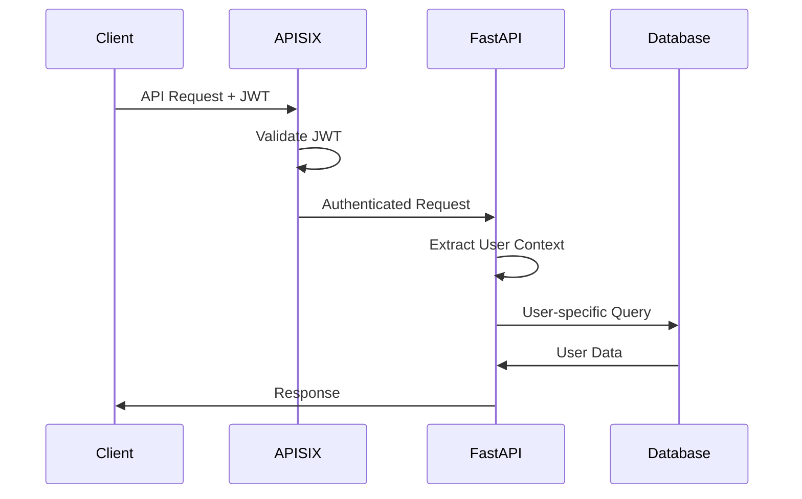
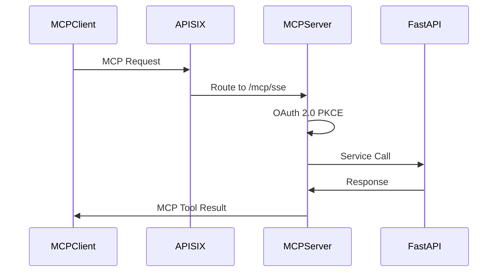

# ViolentUTF Architecture Overview

## Executive Summary

ViolentUTF is an enterprise-grade AI red-teaming platform built on a microservices architecture that combines industry-leading security testing frameworks (PyRIT, Garak), enterprise authentication (Keycloak), API gateway (APISIX), and Model Context Protocol (MCP) integration. This document provides a comprehensive overview of the system architecture, including components, data flows, and integration patterns.

## Architecture Principles

### 1. **Security by Design**
- Zero-trust architecture with authentication required for all operations
- User isolation through separate data stores and strong access controls
- JWT-based authentication with automatic token refresh
- Encrypted communication between all services

### 2. **Microservices Architecture**
- Clear separation of concerns with independent, deployable services
- Docker containerization for consistent deployment and scaling
- Service discovery and routing through APISIX gateway
- Health monitoring and fault tolerance

### 3. **Enterprise Integration**
- Standards-based authentication through Keycloak SSO
- Model Context Protocol (MCP) for AI tool integration
- RESTful APIs with comprehensive OpenAPI documentation
- Audit logging and compliance reporting

### 4. **Performance and Scalability**
- Multi-database architecture optimized for different workload types
- Asynchronous processing for long-running security tests
- Caching strategies for improved response times
- Horizontal scaling capabilities

## System Context



## Container Architecture

The ViolentUTF platform consists of the following containerized services:

### Core Application Services

#### 1. **Streamlit Dashboard** (Port 8501)
- **Purpose**: Web-based user interface for security testing operations
- **Technology**: Python/Streamlit
- **Key Features**:
  - Generator and scorer configuration
  - Dataset management and loading
  - Real-time test execution monitoring
  - Results visualization and reporting
  - JWT-based authentication integration

#### 2. **FastAPI Backend** (Internal Port 8000)
- **Purpose**: REST API for all business logic and data operations
- **Technology**: Python/FastAPI with async support
- **Key Features**:
  - 20+ REST endpoints for platform operations
  - PyRIT and Garak framework integration
  - Multi-database data access layer
  - User context management and authorization
  - Comprehensive OpenAPI documentation

#### 3. **MCP Server** (Endpoint: /mcp/sse)
- **Purpose**: Model Context Protocol server with 23+ tools and 12+ prompts
- **Technology**: Python/JSON-RPC 2.0 over Server-Sent Events
- **Key Features**:
  - Tool interface for generator and orchestrator management
  - Resource interface for configuration and dataset access
  - Prompt interface for security testing templates
  - OAuth 2.0 proxy with PKCE support
  - Real-time streaming capabilities

### Infrastructure Services

#### 4. **APISIX Gateway** (Port 9080)
- **Purpose**: API gateway with authentication, routing, and proxy capabilities
- **Technology**: OpenResty/Lua
- **Key Features**:
  - JWT token validation and routing
  - Rate limiting and abuse protection
  - AI provider proxy endpoints
  - Request/response transformation
  - Health check aggregation

#### 5. **Keycloak SSO** (Port 8080)
- **Purpose**: Identity and access management
- **Technology**: Java/Keycloak
- **Key Features**:
  - Multi-realm user management
  - OAuth 2.0 and SAML federation
  - Role-based access control
  - External identity provider integration
  - Session management and token lifecycle

### Security Testing Frameworks

#### 6. **PyRIT Framework**
- **Purpose**: Microsoft's Python Risk Identification Toolkit integration
- **Technology**: Python with DuckDB memory storage
- **Key Features**:
  - 20+ built-in security scorers
  - Multi-turn conversation orchestration
  - Customizable prompt templates
  - Memory management for conversation history
  - Extensive AI provider integration

#### 7. **Garak Scanner**
- **Purpose**: LLM vulnerability scanning and probing
- **Technology**: Python
- **Key Features**:
  - 100+ vulnerability probes
  - Pre-built attack datasets
  - Automated vulnerability classification
  - Comprehensive reporting
  - Integration with custom targets

#### 8. **IronUTF Defense**
- **Purpose**: Real-time AI endpoint protection
- **Technology**: Python
- **Key Features**:
  - Prompt injection detection
  - Content filtering and sanitization
  - Real-time threat analysis
  - Custom protection rules
  - Performance monitoring

## Data Architecture

### Database Architecture Overview

ViolentUTF employs a **multi-database architecture** designed for performance, security, and scalability:



#### PostgreSQL (Identity Management)
- **Purpose**: Keycloak identity and access management data
- **Data Types**: Users, roles, permissions, sessions, realm configuration
- **Characteristics**: ACID compliance, strong consistency, enterprise security
- **Access Pattern**: Authentication-heavy reads, infrequent writes

#### SQLite (Application Data)
- **Purpose**: FastAPI application state and shared configuration
- **Data Types**: API keys, user sessions, audit logs, system configuration
- **Characteristics**: Lightweight, ACID compliance, single-file deployment
- **Access Pattern**: Mixed read/write, moderate transaction volume

#### DuckDB (User Data & Analytics)
- **Purpose**: User-specific configurations and PyRIT memory storage
- **Data Types**: Generators, datasets, scorers, conversations, embeddings
- **Characteristics**: Column-oriented, analytics-optimized, user isolation
- **Access Pattern**: Analytics-heavy queries, append-mostly data

#### File System (Static Content)
- **Purpose**: Configuration files, datasets, templates, and reports
- **Data Types**: YAML/JSON configs, test datasets, generated reports
- **Characteristics**: Direct access, version control integration, simple backup
- **Access Pattern**: Read-heavy for configs, write-heavy for reports

### User Data Isolation Strategy

User data isolation is implemented through hash-based database naming:

```python
# Generate user-specific database path
salt = os.getenv("PYRIT_DB_SALT", "default_salt_2025")
hashed_username = hashlib.sha256(
    salt.encode() + username.encode()
).hexdigest()
db_path = f"./app_data/violentutf/pyrit_memory_{hashed_username}.db"
```

This approach provides:
- **Security**: Prevents cross-user data access
- **Privacy**: User data completely isolated
- **Performance**: User-specific optimization possible
- **Scalability**: Easy to distribute across storage systems

## Authentication and Authorization Flow

### 1. Initial Authentication


### 2. API Request Authentication


### 3. MCP Protocol Authentication


## API and Integration Patterns

### REST API Architecture
The FastAPI backend provides a comprehensive REST API:

```
/api/v1/
├── /auth/              # Authentication endpoints
├── /generators/        # AI generator management
├── /orchestrators/     # PyRIT orchestrator operations
├── /datasets/          # Dataset configuration
├── /scorers/           # Scorer management
├── /converters/        # Data converter operations
├── /health/            # Service health checks
├── /database/          # Database operations
└── /files/             # File management
```

### MCP Tool Interface
The MCP server exposes 23+ specialized tools:

#### Generator Management Tools
- `create_generator`: Create new AI generator configurations
- `list_generators`: List available generators for user
- `update_generator`: Modify generator parameters
- `test_generator`: Test generator functionality

#### Orchestrator Tools
- `execute_orchestrator`: Run PyRIT security tests
- `get_orchestrator_status`: Check test execution status
- `list_orchestrator_results`: Get test results
- `cancel_orchestrator`: Stop running tests

#### Security Analysis Tools
- `run_vulnerability_scan`: Execute Garak vulnerability scans
- `analyze_conversation`: Analyze conversation for security issues
- `generate_security_report`: Create comprehensive security reports
- `check_bias_detection`: Run bias detection analysis

### Resource Interface
The MCP server provides access to platform resources:

#### Configuration Resources
- Generator configuration files
- Scorer parameter templates
- Dataset metadata
- System configuration

#### Data Resources
- Test result files
- Conversation history
- Generated reports
- Log files

#### Template Resources
- Jailbreak prompt templates
- Security test scenarios
- Report templates
- Configuration templates

## Security Architecture

### 1. **Zero-Trust Network Architecture**
- All services require authentication
- No direct database access from external clients
- Encrypted communication between services
- Network isolation through Docker networks

### 2. **User Data Protection**
- User-specific database isolation
- Hash-based database naming prevents enumeration
- JWT-based access control for all operations
- Audit logging for all data access

### 3. **Infrastructure Security**
- Container-based deployment with minimal attack surface
- Regular security updates and vulnerability scanning
- SSL/TLS for all external communications
- Secrets management through environment variables

### 4. **Compliance and Auditing**
- Comprehensive audit logging in SQLite
- Security event detection and alerting
- Data access pattern analysis
- Compliance reporting capabilities

## Deployment Architecture

### Container Orchestration
```yaml
# Docker Compose structure
services:
  streamlit:
    image: violentutf/streamlit
    ports: ["8501:8501"]
    networks: [vutf-network]

  fastapi:
    image: violentutf/fastapi
    ports: ["8000:8000"]
    networks: [vutf-network]

  apisix:
    image: apache/apisix
    ports: ["9080:9080", "9001:9001"]
    networks: [vutf-network]

  keycloak:
    image: quay.io/keycloak/keycloak
    ports: ["8080:8080"]
    networks: [vutf-network, postgres-network]

  postgres:
    image: postgres:15
    networks: [postgres-network]
    volumes: [postgres_data:/var/lib/postgresql/data]
```

### Network Architecture
- **vutf-network**: Main application network
- **postgres-network**: Isolated database network
- External access only through APISIX gateway
- Health checks for all services

### Data Persistence
- **PostgreSQL**: Docker volume for identity data
- **SQLite**: Host-mounted file for application data
- **DuckDB**: Host-mounted directory for user databases
- **File System**: Host-mounted directories for static content

## Performance and Scaling Considerations

### 1. **Database Performance**
- **PostgreSQL**: Connection pooling, read replicas for scaling
- **SQLite**: WAL mode for better concurrency
- **DuckDB**: Column-oriented storage for analytics performance
- **File System**: Direct I/O for configuration access

### 2. **Application Performance**
- Async/await patterns throughout FastAPI backend
- Connection pooling for all database connections
- Caching strategies for frequently accessed data
- Streaming responses for large datasets

### 3. **Horizontal Scaling**
- Stateless application design allows horizontal scaling
- Database sharding strategies for user data
- Load balancing through APISIX
- Container orchestration with Kubernetes (future)

## Monitoring and Observability

### 1. **Health Monitoring**
- Service health checks for all containers
- Database connection monitoring
- API endpoint health validation
- Real-time performance metrics

### 2. **Logging Strategy**
- Structured logging throughout the application
- Centralized log aggregation
- Security event logging
- Performance metrics collection

### 3. **Alerting and Notifications**
- Service failure notifications
- Performance threshold alerts
- Security event notifications
- Capacity planning alerts

## Future Architecture Evolution

### 1. **Cloud Migration Strategy**
- Container-based architecture supports cloud deployment
- Database migration to cloud services (RDS, Cloud SQL)
- Kubernetes orchestration for scalability
- Multi-region deployment for availability

### 2. **Technology Evolution**
- **DuckDB Deprecation**: Migration to PostgreSQL for user data
- **Redis Caching**: Implementation of caching layer
- **Message Queue**: Asynchronous job processing
- **Service Mesh**: Advanced networking and security

### 3. **Integration Expansion**
- Additional AI provider integrations
- Enhanced MCP tool ecosystem
- Third-party security tool integrations
- Enterprise security platform connectors

## Related Documentation

### Architecture Diagrams
- [System Context Diagram](c4-model/system-context.puml)
- [Container Diagram](c4-model/container-diagram.puml)
- [FastAPI Component Diagram](c4-model/fastapi-component-diagram.puml)
- [MCP Component Diagram](c4-model/mcp-component-diagram.puml)

### Data Flow Documentation
- [Authentication Flow](data-flows/authentication-flow.puml)
- [API Data Flow](data-flows/api-data-flow.puml)
- [MCP Integration Flow](data-flows/mcp-integration-flow.puml)

### Database Documentation
- [Database Architecture Overview](../database/architecture-overview.md)
- [Component Interaction Map](component-diagrams/database-interaction-map.puml)

### Architecture Decision Records
- [ADR-001: Database Technology Choices](../adr/001-database-technology-choices.md)
- [ADR-002: DuckDB Deprecation Strategy](../adr/002-duckdb-deprecation-strategy.md)

---

**Document Version**: 1.0
**Last Updated**: 2025-01-17
**Next Review**: 2025-04-17
