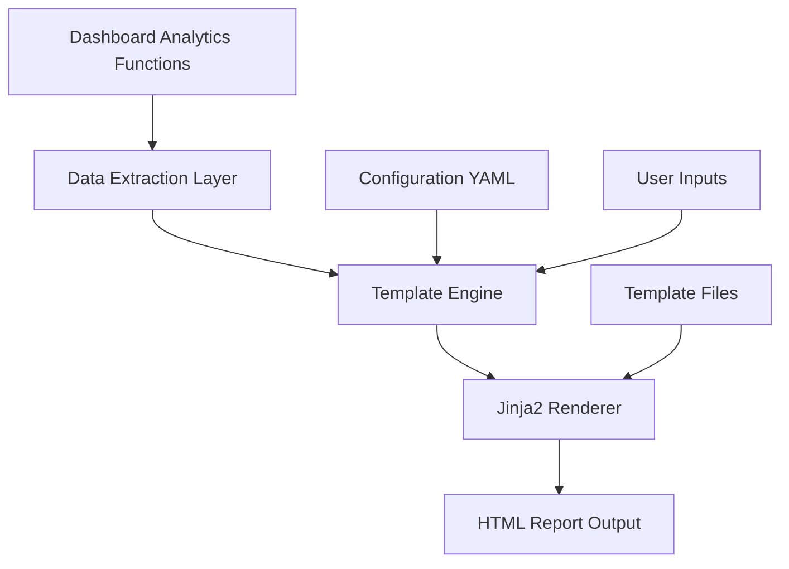

# Issue #246 Implementation Plan: Professional Jinja2-based Template System

## Executive Summary

This implementation plan addresses GitHub issue #246, which requires the development of a professional Jinja2-based template system that transforms existing ViolentUTF analytics into standardized security reports. The system will leverage existing dashboard functions and integrate seamlessly with the current architecture.

## Problem Statement & Analysis

### Current State
- Manual creation of professional security reports from ViolentUTF analytics data
- Time-consuming and inconsistent formatting
- No standardized report templates
- Existing analytics functions in `violentutf/pages/5_Dashboard.py` provide rich data but lack professional presentation

### Target State
- Automated generation of standardized, professional security reports
- Jinja2-based templating system with professional styling
- 90% reduction in manual report formatting time
- Integration with existing analytics functions
- Customizable templates and branding

### Success Criteria
- Professional HTML reports with proper styling, headers, and data visualization
- Template variables properly substituted from existing analytics functions
- Customizable report branding and sections through configuration
- Unified format for both PyRIT and Garak test results
- Comprehensive documentation and user guides

## Technical Architecture

### Core Components

#### 1. Template Engine (`violentutf/utils/template_engine.py`)
**Responsibility**: Core Jinja2 templating functionality and security
**Key Features**:
- Template rendering with security validation
- Configuration loading and validation
- Template variable mapping and sanitization
- Input sanitization to prevent template injection attacks

#### 2. Template Storage (`violentutf/templates/`)
**Structure**:
```
violentutf/templates/
├── base.html                    # Base template with common structure
├── executive_summary.html       # Executive summary section
├── security_metrics.html        # Security metrics visualization
├── performance_analytics.html   # Performance analytics section
├── attack_patterns.html        # Attack pattern analysis
├── threat_intelligence.html    # Threat intelligence section
└── components/
    ├── charts.html             # Chart rendering components
    ├── tables.html             # Table formatting components
    └── headers.html            # Header and branding components
```

#### 3. Configuration System (`violentutf/parameters/reporting/`)
**Structure**:
```
violentutf/parameters/reporting/
├── default_config.yaml         # Default reporting configuration
├── template_settings.yaml      # Template-specific settings
└── branding_config.yaml       # Branding and styling options
```

#### 4. Data Integration Layer
**Integration Points**:
- `load_orchestrator_executions_with_results()` (5_Dashboard.py lines 102-148)
- `calculate_comprehensive_metrics()` (5_Dashboard.py lines 207-284)
- `render_executive_dashboard()` data (5_Dashboard.py lines 286-400)
- `create_interactive_visualizations()` (6_Advanced_Dashboard.py lines 362-426)

### Data Flow Architecture



## Implementation Details

### Phase 1: Core Infrastructure
1. **Template Engine Implementation**
   - Jinja2 integration with security features
   - Template loading and validation
   - Configuration management
   - Input sanitization and security

2. **Directory Structure Creation**
   - Template directory setup
   - Configuration directory creation
   - Component organization

### Phase 2: Template Development
1. **Base Template**
   - Professional HTML structure
   - CSS styling for corporate appearance
   - Responsive design
   - Accessibility compliance (WCAG AA)

2. **Section Templates**
   - Executive Summary
   - Security Metrics
   - Performance Analytics
   - Attack Pattern Analysis
   - Threat Intelligence

3. **Component Templates**
   - Chart embedding
   - Data table formatting
   - Header and branding elements

### Phase 3: Data Integration
1. **Analytics Function Enhancement**
   - Extend `calculate_comprehensive_metrics()` for template compatibility
   - Create template-specific data transformation functions
   - Ensure data consistency and validation

2. **Template Variable Mapping**
   - Map existing analytics data to template variables
   - Create unified data structure for templates
   - Handle missing or incomplete data gracefully

### Phase 4: Configuration System
1. **YAML Configuration**
   - Default reporting settings
   - Template customization options
   - Branding configuration
   - Section inclusion/exclusion settings

2. **Configuration Validation**
   - Schema validation for YAML files
   - Error handling for invalid configurations
   - Default fallbacks for missing settings

### Phase 5: Security Implementation
1. **Template Injection Prevention**
   - Input sanitization for all user-provided variables
   - Template sandbox environment
   - Secure template loading
   - XSS prevention measures

2. **Authentication Integration**
   - Leverage existing Keycloak SSO
   - Respect data access controls
   - Audit logging for report generation

### Phase 6: Testing & Documentation
1. **Comprehensive Test Suite**
   - Unit tests for template engine
   - Integration tests with analytics functions
   - Security validation tests
   - End-to-end report generation tests

2. **Documentation Creation**
   - Technical API documentation
   - User setup guides
   - Troubleshooting documentation
   - Template customization tutorials

## Template Variable Specifications

### Executive Dashboard Variables
From `render_executive_dashboard()` function:
- `total_executions`: Number of orchestrator executions
- `total_scores`: Total security scores generated
- `violation_rate`: Overall violation percentage
- `severity_breakdown`: Distribution of severity levels
- `unique_scorers`: Number of different scorers used
- `unique_generators`: Number of AI models tested
- `unique_datasets`: Number of datasets processed

### Security Metrics Variables
From `render_security_metrics()` function:
- `scorer_performance`: Performance statistics by scorer
- `critical_violations`: High-severity security violations
- `compliance_status`: Overall security compliance status
- `risk_assessment`: Risk level categorization

### Performance Analytics Variables
From `render_performance_analytics()` function:
- `execution_times`: Performance timing data
- `throughput_metrics`: Processing throughput statistics
- `resource_utilization`: System resource usage
- `scalability_metrics`: Concurrent processing statistics

### Attack Pattern Variables
From `render_attack_pattern_analysis()` function:
- `attack_categories`: Distribution of attack types
- `successful_attacks`: Successful penetration attempts
- `defense_effectiveness`: Defense mechanism performance
- `pattern_trends`: Temporal attack pattern analysis

### Threat Intelligence Variables
From `render_threat_intelligence()` function:
- `threat_landscape`: Current threat environment
- `vulnerability_assessment`: Identified vulnerabilities
- `mitigation_recommendations`: Security recommendations
- `threat_indicators`: IoCs and threat intelligence

## Configuration Schema

### Default Configuration (`default_config.yaml`)
```yaml
reporting:
  generate_report: true
  report_format: "HTML"
  include_sections:
    - executive_summary
    - methodology
    - detailed_results
    - analysis_and_discussion
    - recommendations
    - appendix
  report_template: "templates/base.html"
  output_directory: "reports/"
  include_company_branding: true
  anonymize_sensitive_information: false

  # PyRIT-specific options
  pyrit_options:
    include_interactive_visualizations: true
    include_conversation_analytics: true

  # Garak-specific options
  garak_options:
    include_avid_output: true
    include_failure_rate_statistics: true
    include_detailed_attempt_logs: false

styling:
  color_scheme: "professional"
  font_family: "Arial, sans-serif"
  include_charts: true
  chart_style: "plotly"

branding:
  company_name: ""
  company_logo: ""
  report_title_prefix: "ViolentUTF Security Assessment"
  classification_marking: ""
```

### Template Settings (`template_settings.yaml`)
```yaml
templates:
  base_template: "base.html"
  sections:
    executive_summary:
      template: "executive_summary.html"
      required_variables: ["total_executions", "violation_rate", "severity_breakdown"]
      optional_variables: ["executive_notes"]
    security_metrics:
      template: "security_metrics.html"
      required_variables: ["scorer_performance", "critical_violations"]
      optional_variables: ["compliance_framework"]
    performance_analytics:
      template: "performance_analytics.html"
      required_variables: ["execution_times", "throughput_metrics"]
      optional_variables: ["resource_recommendations"]

components:
  charts:
    template: "components/charts.html"
    supported_types: ["bar", "line", "pie", "scatter", "heatmap"]
  tables:
    template: "components/tables.html"
    styling: "bootstrap"
  headers:
    template: "components/headers.html"
    include_navigation: true
```

## Security Considerations

### Template Injection Prevention
1. **Input Sanitization**
   - HTML escape all user-provided variables
   - Validate template paths to prevent directory traversal
   - Sanitize configuration inputs

2. **Template Sandbox**
   - Restrict template access to authorized directories only
   - Disable dangerous Jinja2 features (file inclusion, etc.)
   - Implement template execution timeout

3. **Authentication & Authorization**
   - Require valid JWT tokens for report generation
   - Respect existing data access boundaries
   - Log all template usage and report generation

### Data Privacy & Security
1. **Sensitive Information Handling**
   - Optional anonymization of sensitive data
   - Configurable data masking
   - Secure temporary file handling

2. **Audit Logging**
   - Log all report generation activities
   - Track template usage and modifications
   - Monitor for suspicious template access patterns

## Testing Strategy

### Unit Testing
- Template engine functionality
- Configuration loading and validation
- Data transformation functions
- Security sanitization functions

### Integration Testing
- End-to-end report generation with real data
- Integration with existing analytics functions
- Authentication and authorization workflows
- Configuration management integration

### Security Testing
- Template injection attack prevention
- Input validation and sanitization
- Authentication bypass attempts
- Data access boundary verification

### Performance Testing
- Large dataset report generation
- Concurrent report generation
- Memory usage optimization
- Template rendering performance

## Documentation Deliverables

### Technical Documentation
1. **API Documentation** (`docs/api/template_engine_api.md`)
   - Complete function documentation with examples
   - Template variable reference
   - Configuration schema documentation

2. **Architecture Documentation**
   - System design patterns and rationale
   - Data flow diagrams
   - Security architecture documentation

### User Guides
1. **Template Setup Guide** (`docs/guides/Guide_Template_Setup.md`)
   - Quick start tutorial
   - Template creation walkthrough
   - Configuration guide

2. **Template Testing Guide** (`docs/guides/Guide_Template_Testing.md`)
   - Template validation procedures
   - Debugging techniques
   - Quality assurance guidelines

3. **Template Customization Tutorial** (`docs/guides/Guide_Template_Customization.md`)
   - Advanced template features
   - Custom branding implementation
   - Multi-format optimization

### Support Documentation
1. **Troubleshooting Guide** (`docs/troubleshooting/template_system_troubleshooting.md`)
   - Common issues and solutions
   - Performance optimization
   - Security configuration problems

2. **FAQ Document** (`docs/guides/Template_FAQ.md`)
   - Frequently asked questions
   - Best practices
   - Migration guidelines

## Risk Assessment & Mitigation

### Technical Risks
1. **Template Security Vulnerabilities**
   - Risk: Template injection attacks
   - Mitigation: Comprehensive input sanitization and sandbox environment

2. **Performance Impact**
   - Risk: Large reports causing system slowdown
   - Mitigation: Asynchronous processing and pagination options

3. **Data Inconsistency**
   - Risk: Analytics data changes affecting template rendering
   - Mitigation: Data validation and graceful error handling

### Operational Risks
1. **User Adoption**
   - Risk: Complex template system reducing user adoption
   - Mitigation: Comprehensive documentation and simple default templates

2. **Maintenance Overhead**
   - Risk: Complex template system requiring extensive maintenance
   - Mitigation: Modular design and comprehensive automated testing

## Success Metrics

### Quantitative Metrics
- 90% reduction in manual report formatting time
- < 3 seconds report generation for standard reports
- 85%+ code coverage for all template system components
- Zero template injection vulnerabilities in security testing

### Qualitative Metrics
- Professional appearance matching corporate standards
- User satisfaction with template customization capabilities
- Successful integration with existing ViolentUTF workflows
- Comprehensive documentation enabling self-service adoption

## Timeline & Milestones

### Phase 1: Foundation (40% of effort)
- Template engine core implementation
- Basic template structure
- Configuration system foundation

### Phase 2: Integration (30% of effort)
- Analytics function integration
- Data transformation layer
- Template variable mapping

### Phase 3: Enhancement (20% of effort)
- Advanced templates and components
- Security implementation
- Performance optimization

### Phase 4: Validation (10% of effort)
- Comprehensive testing
- Documentation completion
- User acceptance validation

## Conclusion

This implementation plan provides a comprehensive roadmap for developing a professional Jinja2-based template system that meets all requirements specified in GitHub issue #246. The system will integrate seamlessly with existing ViolentUTF analytics functions while providing the flexibility and security required for enterprise security reporting.

The modular architecture ensures maintainability and extensibility, while the comprehensive security measures protect against common template-related vulnerabilities. The extensive documentation and testing strategy ensure successful adoption and long-term sustainability of the template system.
