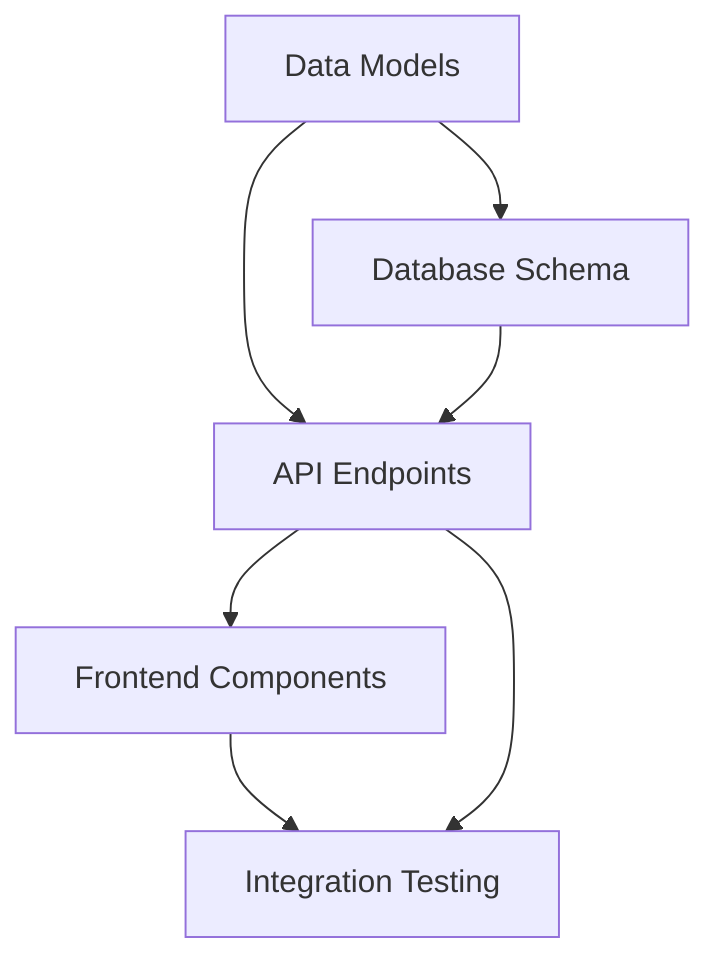

# Development Planning Guide for Complex Projects

## Overview
This guide outlines the steps and procedures for constructing a development plan for complex projects, using the Advanced Dashboard Report Setup Page as a reference model.

## Phase 1: Discovery and Requirements Analysis (2-3 weeks)

### 1.1 Stakeholder Identification and Engagement
```
Key Activities:
├── Identify all stakeholders (users, technical teams, management)
├── Conduct initial interviews
├── Document expectations and constraints
└── Establish communication channels
```

**Deliverables:**
- Stakeholder map with roles and responsibilities
- Initial requirements document
- Communication plan

### 1.2 Current State Analysis
```
Analysis Areas:
├── Existing System Architecture
│   ├── Technology stack assessment
│   ├── Integration points mapping
│   └── Security and compliance requirements
├── User Workflows
│   ├── Current process documentation
│   ├── Pain points identification
│   └── Efficiency bottlenecks
└── Data Analysis
    ├── Data sources and formats
    ├── Volume and velocity assessment
    └── Quality and consistency review
```

**Key Questions:**
- What exists today that we can leverage?
- What are the critical pain points?
- What are the non-negotiables (security, compliance)?

### 1.3 Requirements Gathering

#### Functional Requirements Template
```markdown
## Feature: [Feature Name]
### User Story
As a [user type], I want to [action] so that [benefit].

### Acceptance Criteria
- [ ] Criterion 1
- [ ] Criterion 2

### Priority: [Critical/High/Medium/Low]
### Dependencies: [List any dependencies]
```

#### Non-Functional Requirements Categories
1. **Performance**: Response times, throughput, scalability
2. **Security**: Authentication, authorization, data protection
3. **Usability**: Accessibility, user experience standards
4. **Reliability**: Uptime, error handling, recovery
5. **Maintainability**: Code standards, documentation
6. **Compliance**: Regulatory requirements

## Phase 2: Solution Design and Architecture (2-3 weeks)

### 2.1 High-Level Architecture Design

```
Architecture Components:
├── Frontend Layer
│   ├── UI Framework selection
│   ├── Component architecture
│   └── State management approach
├── Backend Services
│   ├── API design (REST/GraphQL)
│   ├── Service decomposition
│   └── Database schema
├── Integration Layer
│   ├── External systems
│   ├── Authentication/Authorization
│   └── Message queuing
└── Infrastructure
    ├── Deployment architecture
    ├── Monitoring and logging
    └── Backup and recovery
```

### 2.2 Technical Specification Development

#### Component Specification Template
```yaml
component:
  name: "Report Generation Service"
  type: "Backend Service"
  description: "Handles report generation workflow"

  interfaces:
    - name: "generateReport"
      input: "ReportConfiguration"
      output: "ReportID"
      errors: ["InvalidTemplate", "DataNotFound"]

  dependencies:
    - "Template Service"
    - "Data Aggregation Service"
    - "PDF Generation Library"

  technical_requirements:
    - language: "Python 3.10+"
    - framework: "FastAPI"
    - database: "PostgreSQL"

  performance_targets:
    - "Generate report < 30 seconds"
    - "Handle 100 concurrent requests"
```

### 2.3 Risk Assessment and Mitigation

```markdown
## Risk Register

| Risk | Probability | Impact | Mitigation Strategy | Owner |
|------|------------|--------|-------------------|-------|
| Complex integrations | High | High | Prototype early, incremental integration | Tech Lead |
| Scope creep | Medium | High | Clear change control process | PM |
| Performance issues | Medium | Medium | Load testing, optimization sprints | Dev Team |
```

## Phase 3: Detailed Planning and Breakdown (1-2 weeks)

### 3.1 Work Breakdown Structure (WBS)

```
Project Root
├── 1. Template Management
│   ├── 1.1 Template Gallery
│   │   ├── 1.1.1 Metadata Structure Design
│   │   ├── 1.1.2 Search/Filter Implementation
│   │   └── 1.1.3 Gallery UI Development
│   ├── 1.2 Template Editor
│   │   ├── 1.2.1 Block System Architecture
│   │   ├── 1.2.2 Configuration UI
│   │   └── 1.2.3 Preview Functionality
│   └── 1.3 Version Control
│       ├── 1.3.1 Version Schema Design
│       └── 1.3.2 Version Management UI
├── 2. Report Generation
│   ├── 2.1 Data Selection
│   ├── 2.2 Template Recommendation
│   ├── 2.3 Report Configuration
│   └── 2.4 Generation Engine
└── 3. Scheduling System
    ├── 3.1 Schedule Configuration
    └── 3.2 Execution Engine
```

### 3.2 Task Estimation Framework

#### Three-Point Estimation
```
For each task:
- Optimistic (O): Best-case scenario
- Most Likely (M): Realistic estimate
- Pessimistic (P): Worst-case scenario

Estimate = (O + 4M + P) / 6
Standard Deviation = (P - O) / 6
```

#### Story Point Mapping
```
1 point = 2-4 hours (Simple task)
2 points = 4-8 hours (Standard task)
3 points = 1-2 days (Complex task)
5 points = 2-3 days (Very complex task)
8 points = 3-5 days (Should be broken down)
```

### 3.3 Dependency Mapping



## Phase 4: Development Methodology Selection (1 week)

### 4.1 Agile Framework Customization

```yaml
sprint_configuration:
  duration: 2 weeks
  ceremonies:
    - planning: "Day 1 - 2 hours"
    - daily_standup: "15 minutes"
    - review: "Last day - 1 hour"
    - retrospective: "Last day - 1 hour"

  team_structure:
    - product_owner: 1
    - scrum_master: 1
    - developers: 4-6
    - qa_engineer: 1-2
    - ux_designer: 1
```

### 4.2 Development Phases

```
Phase 1: Foundation (Sprints 1-2)
├── Core infrastructure setup
├── Basic data models
└── Authentication/Authorization

Phase 2: Core Features (Sprints 3-6)
├── Template management
├── Report generation engine
└── Basic UI implementation

Phase 3: Advanced Features (Sprints 7-9)
├── Scheduling system
├── AI integration
└── Advanced visualizations

Phase 4: Polish & Optimization (Sprints 10-11)
├── Performance optimization
├── UI/UX refinement
└── Documentation

Phase 5: Testing & Deployment (Sprint 12)
├── End-to-end testing
├── Deployment preparation
└── Training materials
```

## Phase 5: Resource Planning (1 week)

### 5.1 Team Composition Matrix

| Role | Phase 1 | Phase 2 | Phase 3 | Phase 4 | Phase 5 |
|------|---------|---------|---------|---------|---------|
| Backend Dev | 2 | 3 | 3 | 2 | 1 |
| Frontend Dev | 1 | 2 | 2 | 2 | 1 |
| DevOps | 1 | 0.5 | 0.5 | 1 | 2 |
| QA | 0.5 | 1 | 1 | 2 | 2 |
| UX Designer | 1 | 0.5 | 0.5 | 1 | 0 |

### 5.2 Skills Matrix

```markdown
## Required Skills Assessment

| Skill | Current Team | Gap | Mitigation |
|-------|--------------|-----|------------|
| Python/FastAPI | ✓✓✓ | None | - |
| React/Streamlit | ✓✓ | Minor | Training planned |
| AI/ML Integration | ✓ | Major | Hire consultant |
| PDF Generation | - | Major | Research libraries |
```

## Phase 6: Quality Assurance Planning (1 week)

### 6.1 Testing Strategy

```yaml
testing_pyramid:
  unit_tests:
    coverage_target: 80%
    tools: ["pytest", "jest"]

  integration_tests:
    coverage_target: 70%
    tools: ["pytest", "postman"]

  e2e_tests:
    coverage_target: 60%
    tools: ["selenium", "cypress"]

  performance_tests:
    tools: ["locust", "k6"]
    targets:
      - "Report generation < 30s"
      - "Support 100 concurrent users"
```

### 6.2 Quality Gates

```markdown
## Definition of Done
- [ ] Code reviewed by 2 developers
- [ ] Unit tests written and passing
- [ ] Integration tests passing
- [ ] Documentation updated
- [ ] No critical security vulnerabilities
- [ ] Performance benchmarks met
```

## Phase 7: Risk Management and Contingency Planning

### 7.1 Technical Debt Management

```markdown
## Technical Debt Register

| Item | Impact | Effort | Priority | Plan |
|------|--------|--------|----------|------|
| Legacy API integration | High | High | P1 | Refactor in Phase 2 |
| Database optimization | Medium | Medium | P2 | Address in Phase 4 |
```

### 7.2 Contingency Plans

```yaml
scenario_planning:
  - scenario: "AI provider unavailable"
    impact: "Cannot generate AI analysis"
    plan: "Implement fallback to local model"

  - scenario: "Performance issues at scale"
    impact: "Slow report generation"
    plan: "Implement caching, async processing"
```

## Phase 8: Documentation and Knowledge Transfer

### 8.1 Documentation Framework

```
Documentation Structure:
├── Architecture
│   ├── System Overview
│   ├── Component Diagrams
│   └── Data Flow Diagrams
├── API Documentation
│   ├── OpenAPI Specs
│   └── Integration Guides
├── User Documentation
│   ├── User Guides
│   ├── Video Tutorials
│   └── FAQ
└── Developer Documentation
    ├── Setup Guide
    ├── Coding Standards
    └── Troubleshooting
```

### 8.2 Knowledge Transfer Plan

```markdown
## Knowledge Transfer Activities

1. **Weekly Tech Talks**: Share learnings and decisions
2. **Pair Programming**: Rotate pairs weekly
3. **Documentation Days**: Dedicated time for documentation
4. **Recorded Demos**: Archive key functionality demos
```

## Phase 9: Success Metrics and Monitoring

### 9.1 Key Performance Indicators (KPIs)

```yaml
project_kpis:
  delivery:
    - on_time_delivery: "90% of sprints"
    - scope_completion: "95% of planned features"

  quality:
    - defect_rate: "< 5 per sprint"
    - test_coverage: "> 75%"

  performance:
    - report_generation_time: "< 30 seconds"
    - system_availability: "> 99.5%"
```

### 9.2 Monitoring Framework

```markdown
## Monitoring Checklist

- [ ] Application performance monitoring (APM)
- [ ] Error tracking and alerting
- [ ] User analytics
- [ ] Security monitoring
- [ ] Infrastructure monitoring
```

## Phase 10: Launch and Post-Launch Planning

### 10.1 Launch Preparation

```markdown
## Launch Checklist

### 2 Weeks Before Launch
- [ ] Final security audit
- [ ] Load testing completed
- [ ] Documentation finalized
- [ ] Training materials ready

### 1 Week Before Launch
- [ ] Deployment dry run
- [ ] Rollback plan tested
- [ ] Support team briefed
- [ ] Communication plan activated

### Launch Day
- [ ] Monitoring dashboards active
- [ ] Support team on standby
- [ ] Rollback plan ready
- [ ] Success criteria defined
```

### 10.2 Post-Launch Support

```yaml
support_plan:
  immediate: "24/7 for first week"
  short_term: "Business hours for first month"
  long_term: "Standard SLA"

  escalation_path:
    - L1: "General support"
    - L2: "Technical support"
    - L3: "Development team"
```

## Tools and Templates

### Project Management Tools
- **Planning**: Jira, Azure DevOps, Linear
- **Documentation**: Confluence, Notion, GitBook
- **Communication**: Slack, Teams, Discord
- **Version Control**: Git, GitHub/GitLab
- **CI/CD**: Jenkins, GitHub Actions, GitLab CI

### Useful Templates
1. **Requirements Template**: User stories, acceptance criteria
2. **Design Document Template**: Architecture decisions, trade-offs
3. **Sprint Planning Template**: Capacity, commitment, risks
4. **Test Plan Template**: Test scenarios, coverage matrix
5. **Deployment Checklist**: Pre/post deployment steps

## Best Practices and Lessons Learned

### Do's
- ✅ Start with clear, measurable objectives
- ✅ Involve stakeholders early and often
- ✅ Build incrementally with working software
- ✅ Automate repetitive tasks
- ✅ Document decisions and rationale
- ✅ Plan for technical debt management

### Don'ts
- ❌ Skip discovery phase to "save time"
- ❌ Underestimate integration complexity
- ❌ Ignore non-functional requirements
- ❌ Delay testing until the end
- ❌ Assume requirements won't change
- ❌ Neglect team training and knowledge transfer

## Conclusion

A successful development plan for complex projects requires:
1. **Thorough understanding** of requirements and constraints
2. **Realistic estimation** with built-in buffers
3. **Clear communication** channels and documentation
4. **Iterative delivery** with regular feedback
5. **Risk management** with contingency plans
6. **Quality focus** throughout development
7. **Team empowerment** with proper tools and training

The key is to balance comprehensive planning with agility to adapt as you learn more about the problem space and solution requirements.
