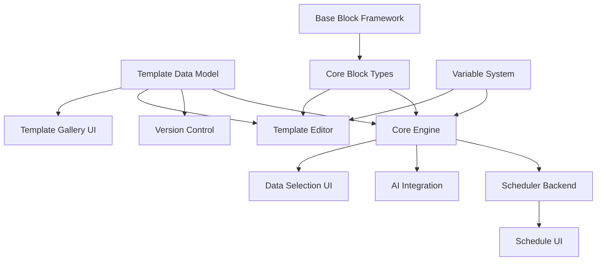

# Advanced Dashboard - Report Setup Page

## Overview

The Report Setup page is a comprehensive interface for managing COB (Close of Business) report templates, generating reports, and configuring automated report schedules. This page will be positioned under the Advanced Dashboard section of the ViolentUTF Streamlit application.

## Main Features

### 1. Template Management Section

#### 1.1 Template Gallery - Red Teaming Focused

**Core Metadata Structure:**
- **Core Identifiers**: ID, name, description, version (e.g., 1.0.0)
- **Red Teaming Classification**: 
  - Testing category (Security/Safety/Reliability/Robustness/Compliance)
  - Target model types (LLM/Vision/Multimodal/Embedding/Custom)
  - Attack categories (Prompt Injection/Jailbreak/Data Leakage/Hallucination/Bias/Toxicity)
  - Compliance frameworks (OWASP LLM/NIST AI RMF/ISO 23053/EU AI Act)
  - Severity focus (Critical/High/Medium/Low/Informational)
- **Testing Configuration**:
  - Scanner compatibility (PyRIT scorers/orchestrators, Garak probes/detectors)
  - Test data requirements (dataset types, minimum samples)
  - Report sections (vulnerability assessment, attack success rates, defense recommendations)
- **Technical Metadata**:
  - AI analysis requirements (models, tokens, scan result processing)
  - Output formats (PDF/JSON/Markdown)
  - Estimated generation time
  - Template complexity level

**Search & Filter System:**
- **Text Search**: Across names, descriptions, attack categories, testing notes
- **Primary Filters**:
  - Testing categories and target models
  - Attack vectors with visual indicators
  - Scanner type (PyRIT/Garak/Both/Any)
  - Compliance framework with coverage display
- **Advanced Filters**:
  - Severity levels (default: Critical & High)
  - Report components selection
  - Complexity slider
- **Quick Scenarios**: Security Audit, Injection Tests, Safety Testing, Compliance, Full Assessment, Quick Scan
- **Sort Options**: Best Match, Severity Focus, Recently Updated, Name, Complexity

**Gallery Implementation:**
- **Card Layout**: Severity indicators, testing badges, scanner compatibility
- **Key Metrics Display**: Scanner type, complexity, report sections, generation time
- **Compliance Badges**: Framework coverage indicators
- **Action Buttons**: Use Template, Preview, Edit, Clone

#### 1.2 Template Editor - Streamlit-Compatible Implementation

**Visual Block Editor Architecture:**
- **Streamlit-Native Approach**: Uses expandable sections, button-based reordering, and session state management
- **Block Management**: Add/remove blocks, reorder with up/down buttons, inline configuration
- **Real-time Preview**: Side panel showing template structure and sample output

**Red Team Report Block Types:**

1. **Executive Summary Block**
   - Summary components: Overall Risk Score, Critical Vulnerabilities Count, Attack Success Rate, Top Attack Vectors, Compliance Status, Key Recommendations
   - Auto-summarize from AI analysis and security metrics blocks
   - Highlight threshold settings (Critical Only/High and Above/Medium and Above)

2. **AI Analysis Block - Scan Result Integration**
   - **Analysis Focus**: Vulnerability assessment, attack pattern analysis, defense recommendations, compliance gaps, risk prioritization
   - **Scan Result Sources**: PyRIT results, Garak results, custom scanner output, previous reports
   - **Prompt Variables**:
     - Scanner variables: {{scanner_type}}, {{target_model}}, {{scan_date}}, {{total_tests}}, {{successful_attacks}}
     - Result variables: {{scan_results}}, {{vulnerability_matrix}}, {{attack_chains}}, {{scorer_outputs}}, {{probe_results}}
   - **Result Processing**: Include raw results option, severity filtering, aggregation levels
   - **AI Providers**: OpenAI GPT-4, Anthropic Claude, GSAi, Local Model
   - **Output Format**: Structured Analysis, Narrative Report, Bullet Points

3. **Security Metrics Block - Compatibility Matrix Integration**
   - **Metric Sources**: Compatibility Matrix Results, PyRIT Scan Metrics, Garak Test Metrics, Combined
   - **Compatibility Matrix Metrics**:
     - Overall Compatibility Score
     - Framework Coverage (OWASP/NIST/ISO)
     - Attack Success Rates by Category
     - Vulnerability Distribution
     - Risk Score Breakdown
     - Compliance Percentage
     - Defense Effectiveness
   - **Visualizations**: Metric Cards, Risk Heatmap, Attack Success Chart, Vulnerability Timeline, Compliance Radar
   - **Severity Thresholds**: Critical (≥9.0), High (≥7.0), Medium (≥4.0), Low (≥0.0)

4. **Attack Results Table**
   - **Data Sources**: PyRIT Attack Results, Garak Probe Results, Combined Results
   - **Display Columns**: Attack Type, Target Component, Success Status, Severity Score, Response Analysis
   - **Filters**: Severity Level, Attack Success, Attack Category, Time Range
   - **Highlighting Rules**: Critical severity (red), Successful attacks (bold), New vulnerabilities (yellow)

5. **Custom Content Block - Simplified**
   - **Markdown-only** content editor
   - **Available Variables**:
     - Scan Results: {{total_tests}}, {{successful_attacks}}, {{failure_rate}}
     - Vulnerabilities: {{total_vulnerabilities}}, {{critical_count}}, {{high_count}}
     - Model Info: {{target_model}}, {{model_version}}, {{deployment_date}}
     - Test Info: {{test_date}}, {{scanner_type}}, {{test_duration}}
     - Metrics: {{risk_score}}, {{compliance_score}}, {{defense_rating}}

**Scan Result Variable System:**
- **Variable Registry**: PyRIT variables, Garak variables, Compatibility Matrix variables, Common variables
- **Variable Helper UI**: Grouped by source, click-to-insert functionality, usage examples
- **Conditional Display**: Support for if-statements based on variable values

#### 1.3 Simplified Template Versioning

**Basic Version Control:**
- **Version Format**: Simple MAJOR.MINOR.PATCH (e.g., 1.2.0)
- **Version Types**: 
  - Patch: Bug fixes, minor updates
  - Minor: New features, backwards compatible
  - Major: Breaking changes
- **Version Storage**: Each version saves a complete template snapshot with timestamp and change notes

**Version Management UI:**
- **Current Version Display**: Shows active version with creation info
- **Create New Version**: 
  - Select change type (patch/minor/major)
  - Add change notes (required)
  - Preview new version number
  - One-click creation
- **Version History**: 
  - Simple list of last 10 versions
  - Shows version number, change notes, author, date
  - Restore button to revert to any previous version

**Streamlined Features:**
- No complex branching or merging
- No approval workflows (can be added later if needed)
- Simple restore functionality instead of migration tools
- Basic change notes instead of detailed changelogs

### 2. Report Generation Section - Improved Data-First Approach

#### Initial Template Library (Toxicity/Safety Focus)

**Core Templates:**
1. **Basic Safety Assessment Report** - Comprehensive safety evaluation focusing on harmful content
2. **Toxicity Analysis Deep Dive** - Detailed analysis of model responses to toxic prompts
3. **Jailbreak Resilience Report** - Assessment of resistance to jailbreak attempts
4. **Bias and Fairness Evaluation** - Comprehensive bias testing across dimensions
5. **Safety Compliance Report** - Compliance-focused report for safety standards

#### 2.1 Manual Report Generation - Reordered Workflow

**New Step-Based Workflow:**
1. **Data Selection** → 2. **Template Recommendation** → 3. **Report Configuration** → 4. **Generation & Export**

**Step 1: Data Selection (NEW FIRST STEP)**
- **Data Source Tabs**: Recent Scans | Search by Model | Search by Date | Search by Type
- **Enhanced Scan Cards**:
  - Scanner type indicator (PyRIT/Garak)
  - Score category badges (☠️ toxicity, 🛡️ safety, ⚖️ bias, 🔓 jailbreak)
  - Key metrics display (tests run, avg toxicity score)
  - Dataset/Orchestrator information
  - Expandable score breakdown table
- **Quick Filters**: "All", "Safety/Toxicity", "Jailbreak", "Bias", "Compliance"
- **Scan Selection**: Checkbox with visual feedback for selected scans

**Step 2: Template Recommendation (Based on Selected Data)**
- **Data Analysis Summary**:
  - Number of scans selected
  - Score categories present
  - Models tested
  - Total tests run
- **Recommended Templates**:
  - Templates matched to scan data categories (>50% overlap)
  - Visual "RECOMMENDED" indicator
  - Automatic suggestion for safety assessment if toxicity data present
- **Template Cards**:
  - Template name and description
  - "Best for" categories
  - Template structure preview
  - Selection buttons (primary for recommended)

**Step 3: Report Configuration**
- **Multi-Format Default**:
  - Output formats default to ["PDF", "JSON"]
  - Format-specific options (PDF style, JSON structure)
- **Enhanced Configuration**:
  - Basic settings with smart defaults
  - Block configuration with available variables
  - AI settings with provider options
  - Advanced data processing options

**Step 4: Generation & Export**
- **Progress Tracking**:
  - 7-stage progress indicator
  - Real-time metrics and logs
- **Multi-Format Output**:
  - Simultaneous generation of selected formats
  - Individual download buttons per format
  - Preview options for each format

**Enhanced Variable System (ViolentUTF API):**
- **Orchestrator Variables**: execution_id, orchestrator_name/type, execution_summary
- **Scoring Variables**: score_value/type/category, score_rationale, scorer_class, avg_toxicity_score, safety_pass_rate
- **Dataset Variables**: dataset_name/category/size, dataset_description
- **Model Variables**: target_model, model_endpoint/version, deployment_name
- **Garak Variables**: vulnerabilities_found, probe_names, generator_used, success_rate
- **Compliance Variables**: owasp_coverage, nist_alignment, framework_gaps

#### 2.2 Extensible Block System

**Backend Architecture:**
```
BaseReportBlock (Abstract)
├── BlockDefinition (metadata, parameters, variables)
├── Validation (config validation)
├── Processing (data transformation)
└── Rendering (PDF/JSON/Markdown output)
```

**Block Registry System:**
- Dynamic block registration
- Category-based organization
- Frontend configuration generator
- Parameter type support (text, select, multiselect, number, boolean, code)

**Example New Block - Toxicity Heatmap:**
- Categories: hate, harassment, violence, sexual, self-harm
- Aggregation: mean, max, p95, count
- Color scales: red_yellow_green, blue_white_red, viridis
- Output: toxicity_matrix, category_summary

#### 2.3 Report Scheduling - Technology Stack

**Leveraging Existing Infrastructure:**
- **Scheduler**: APScheduler with SQLAlchemy persistence (existing DB)
- **Execution**: FastAPI Background Tasks with asyncio
- **Security**: JWT via APISIX, role-based authorization
- **Reliability**: Exponential backoff retry, checkpoint recovery

**Scheduling Features:**
- **Frequency Options**: Daily, Weekly, Monthly, Custom Cron
- **Timezone Support**: Full timezone selection
- **Data Selection Strategies**:
  - Latest scans matching criteria
  - All scans since last report
  - Fixed time window
  - Saved data selection
- **Reliability Options**:
  - Retry on failure (1-5 attempts)
  - Skip on persistent error
  - Checkpoint-based recovery
- **Notifications**:
  - Email, Webhook, In-App
  - Success/Failure notifications
  - Configurable recipients

**Security Implementation:**
- Encrypted auth tokens in job context
- Permission validation for scheduling
- Audit logging for all operations
- Secure execution isolation

### 3. Report Scheduling Section

#### 3.1 Schedule Configuration
- **Schedule Creator**: User-friendly interface for creating schedules
  - Template selection
  - Frequency options (Daily, Weekly, Monthly, Custom)
  - Time selection with timezone support
  - Advanced cron expression support
- **Schedule Calendar View**: Visual calendar showing scheduled reports
- **Schedule Testing**: Test run schedules before activation

#### 3.2 Schedule Management
- **Active Schedules Dashboard**: List of all active schedules
- **Schedule History**: View past executions and their status
- **Schedule Monitoring**: Real-time status of running schedules
- **Failure Alerts**: Configure notifications for failed schedules
- **Schedule Analytics**: Success rate, execution time trends

### 4. Report Export & Distribution

#### 4.1 Export Options
- **Multi-format Export**: 
  - PDF with professional styling
  - JSON for programmatic processing
  - Markdown for documentation
  - HTML for web viewing
- **Bulk Export**: Export multiple reports at once
- **Export Templates**: Save export preferences

#### 4.2 Distribution Settings
- **Email Distribution**: Configure email recipients for reports
- **Webhook Integration**: Send reports to external systems
- **Cloud Storage**: Auto-upload to S3, Azure Blob, GCS
- **API Integration**: Push reports to external APIs

### 5. Report Analytics & History

#### 5.1 Report Dashboard
- **Generation Metrics**: Reports generated over time
- **Template Usage**: Most/least used templates
- **Export Statistics**: Popular export formats
- **Performance Metrics**: Average generation time

#### 5.2 Report Archive
- **Historical Reports**: Browse all generated reports
- **Advanced Search**: Search by date, template, content
- **Report Comparison**: Compare reports side-by-side
- **Retention Management**: Configure report retention policies

### 6. AI Configuration Section

#### 6.1 AI Provider Settings
- **Provider Management**: Configure multiple AI providers
- **Model Selection**: Choose specific models per provider
- **API Key Management**: Secure storage of API credentials
- **Fallback Configuration**: Set backup providers

#### 6.2 Prompt Management
- **Prompt Library**: Save and reuse effective prompts
- **Prompt Testing**: Test prompts with sample data
- **Prompt Variables**: Use dynamic variables in prompts
- **Prompt Performance**: Track prompt effectiveness

### 7. Security & Access Control

#### 7.1 Permission Management
- **Template Permissions**: Control who can create/edit templates
- **Report Access**: Set viewing permissions for reports
- **Schedule Ownership**: Manage schedule ownership
- **Audit Trail**: Track all actions and changes

#### 7.2 Data Security
- **Sensitive Data Handling**: Configure data masking rules
- **Encryption Settings**: Report encryption options
- **Compliance Tools**: GDPR, HIPAA compliance features

## User Interface Design

### Layout Structure
```
┌─────────────────────────────────────────────────────────────┐
│                    Report Setup                              │
├─────────────────────────────────────────────────────────────┤
│ ┌─────────────┐ ┌─────────────┐ ┌─────────────┐           │
│ │  Templates  │ │   Generate  │ │  Schedule   │           │
│ └─────────────┘ └─────────────┘ └─────────────┘           │
├─────────────────────────────────────────────────────────────┤
│                                                             │
│  [Main Content Area - Changes based on selected tab]        │
│                                                             │
│  ┌─────────────────────────────────────────────────────┐  │
│  │                                                       │  │
│  │                 Dynamic Content                       │  │
│  │                                                       │  │
│  └─────────────────────────────────────────────────────┘  │
│                                                             │
│  [Action Buttons]  [Status Messages]                        │
└─────────────────────────────────────────────────────────────┘
```

### Key UI Components
- **Tabbed Navigation**: Easy switching between major sections
- **Sidebar Filters**: Context-aware filtering options
- **Action Toolbar**: Quick access to common actions
- **Status Bar**: Real-time status updates and notifications
- **Help System**: Contextual help and tooltips

## Technical Implementation Notes

### State Management (Implemented ✓)
- Uses Streamlit session state for form data persistence ✓
- Proper state cleanup on navigation ✓
- Template configurations cached for performance ✓

### API Integration (Implemented ✓)
- All operations through `/api/v1/reports/` endpoints ✓
- APISIX routes configured for all endpoints ✓
- Comprehensive error handling and user feedback ✓
- JWT authentication integrated ✓

### Security Considerations
- JWT token validation for all operations
- Input sanitization for template configurations
- Secure handling of AI API credentials
- Audit logging for all actions

### Performance Optimization
- Lazy loading for template gallery
- Pagination for report history
- Background processing for report generation
- Caching strategies for frequently used data

## Future Enhancements

1. **Template Marketplace**: Share templates with the community
2. **AI-Powered Template Suggestions**: Recommend templates based on usage
3. **Natural Language Report Requests**: Generate reports using chat interface
4. **Report Insights**: AI-generated insights from report trends
5. **Mobile App**: Access reports and schedules on mobile devices
6. **Integration Hub**: Connect with more external services
7. **Custom Visualizations**: Add custom chart types and visualizations
8. **Collaborative Editing**: Multi-user template editing
9. **Report Automation Workflows**: Chain reports and actions
10. **Advanced Analytics**: Predictive analytics on security trends

## Development Plan for Report Features

### Executive Summary

This development plan outlines the implementation strategy for the Advanced Dashboard Report Setup features in ViolentUTF. The plan follows a phased approach over 24 weeks (6 months), focusing on delivering a robust, security-focused reporting system for AI red teaming results.

### Phase 1: Discovery and Requirements Analysis (Weeks 1-3)

#### 1.1 Stakeholder Analysis

**Key Stakeholders:**
- **Primary Users**: Security analysts, AI safety researchers, compliance officers
- **Technical Teams**: ViolentUTF development team, PyRIT/Garak integration teams
- **Management**: Security leadership requiring executive reports
- **External**: Compliance auditors, partner organizations

**Stakeholder Requirements Matrix:**
| Stakeholder | Key Requirements | Priority |
|-------------|------------------|----------|
| Security Analysts | Detailed vulnerability reports, attack chain visualization | Critical |
| AI Safety Researchers | Toxicity/bias analysis, safety metrics | Critical |
| Compliance Officers | Framework alignment reports, audit trails | High |
| Management | Executive summaries, trend analysis | High |
| Technical Teams | API integration, extensibility | Medium |

#### 1.2 Current State Analysis

**Existing Components to Leverage:**
- ViolentUTF API infrastructure (FastAPI, MCP)
- PyRIT/Garak integration endpoints
- APISIX authentication/authorization
- Streamlit dashboard framework
- DuckDB for PyRIT memory
- Existing scoring systems and datasets

**Gap Analysis:**
| Component | Current State | Target State | Gap |
|-----------|--------------|--------------|-----|
| Report Templates | None | 5+ toxicity/safety templates | Full implementation needed |
| Template Editor | None | Streamlit-based block editor | Full implementation needed |
| Report Generation | Basic JSON output | Multi-format with AI analysis | Major enhancement needed |
| Scheduling | None | APScheduler with persistence | Full implementation needed |
| Variable System | Limited | Comprehensive scan variables | Enhancement needed |

#### 1.3 Functional Requirements

**Critical Requirements:**
1. **Template Management**
   - Create/edit/version report templates
   - Block-based template composition
   - Scan result variable integration
   - Template recommendations based on data

2. **Report Generation**
   - Data-first workflow (select scans → template → generate)
   - Multi-format output (PDF + JSON default)
   - AI-powered analysis blocks
   - Real-time progress tracking

3. **Report Scheduling**
   - Cron-based scheduling with timezone support
   - Failure recovery and notifications
   - Security-isolated execution

**Non-Functional Requirements:**
- **Performance**: Report generation < 30 seconds for standard reports
- **Security**: JWT authentication, encrypted credentials, audit logging
- **Reliability**: 99.5% uptime, automatic retry on failure
- **Scalability**: Support 100 concurrent report generations
- **Usability**: Intuitive UI following Streamlit patterns

### Phase 2: Solution Design and Architecture (Weeks 4-6)

#### 2.1 High-Level Architecture

```
┌─────────────────────────────────────────────────────────┐
│                   Streamlit Frontend                     │
│  ┌─────────────┐ ┌─────────────┐ ┌─────────────┐      │
│  │  Template   │ │   Report    │ │  Schedule   │      │
│  │  Manager    │ │  Generator  │ │  Manager    │      │
│  └─────────────┘ └─────────────┘ └─────────────┘      │
└─────────────────────────┬───────────────────────────────┘
                          │ JWT Auth
┌─────────────────────────┴───────────────────────────────┐
│                    APISIX Gateway                        │
└─────────────────────────┬───────────────────────────────┘
                          │
┌─────────────────────────┴───────────────────────────────┐
│                   FastAPI Backend                        │
│  ┌─────────────┐ ┌─────────────┐ ┌─────────────┐      │
│  │  Template   │ │   Report    │ │  Schedule   │      │
│  │  Service    │ │   Engine    │ │  Service    │      │
│  └─────────────┘ └─────────────┘ └─────────────┘      │
│         │                │                │              │
│  ┌──────┴──────┐ ┌──────┴──────┐ ┌──────┴──────┐      │
│  │  Template   │ │   PyRIT/    │ │ APScheduler │      │
│  │  Storage    │ │   Garak     │ │    Jobs     │      │
│  └─────────────┘ └─────────────┘ └─────────────┘      │
└──────────────────────────────────────────────────────────┘
```

#### 2.2 Component Specifications

**Template Service:**
```yaml
component:
  name: "Template Service"
  type: "Backend Service"
  description: "Manages report templates with versioning"
  
  interfaces:
    - name: "createTemplate"
      input: "TemplateDefinition"
      output: "TemplateID"
      errors: ["InvalidTemplate", "PermissionDenied"]
    
    - name: "getTemplateRecommendations"
      input: "ScanDataSummary"
      output: "List[TemplateRecommendation]"
  
  dependencies:
    - "PostgreSQL Database"
    - "Block Registry"
    - "Version Control System"
  
  performance_targets:
    - "Template operations < 500ms"
    - "Support 1000+ templates"
```

**Report Engine:**
```yaml
component:
  name: "Report Generation Engine"
  type: "Backend Service"
  description: "Generates reports from templates and scan data"
  
  interfaces:
    - name: "generateReport"
      input: "ReportRequest"
      output: "ReportID"
      async: true
    
    - name: "processAIBlock"
      input: "AIBlockConfig, ScanData"
      output: "ProcessedContent"
  
  dependencies:
    - "Template Service"
    - "PyRIT/Garak APIs"
    - "AI Providers (OpenAI, Anthropic)"
    - "PDF Generation (ReportLab)"
  
  performance_targets:
    - "Standard report < 30 seconds"
    - "Handle 10 concurrent generations"
```

#### 2.3 Data Model Design

**Core Entities:**
```sql
-- Report Templates
CREATE TABLE report_templates (
    id UUID PRIMARY KEY,
    name VARCHAR(255) NOT NULL,
    description TEXT,
    version VARCHAR(20) NOT NULL,
    metadata JSONB NOT NULL,
    blocks JSONB NOT NULL,
    created_by VARCHAR(255),
    created_at TIMESTAMP,
    updated_at TIMESTAMP
);

-- Template Versions
CREATE TABLE template_versions (
    id UUID PRIMARY KEY,
    template_id UUID REFERENCES report_templates(id),
    version VARCHAR(20) NOT NULL,
    change_notes TEXT,
    snapshot JSONB NOT NULL,
    created_by VARCHAR(255),
    created_at TIMESTAMP
);

-- Generated Reports
CREATE TABLE generated_reports (
    id UUID PRIMARY KEY,
    template_id UUID REFERENCES report_templates(id),
    scan_data JSONB NOT NULL,
    output_formats TEXT[],
    status VARCHAR(50),
    progress INTEGER,
    results JSONB,
    created_by VARCHAR(255),
    created_at TIMESTAMP,
    completed_at TIMESTAMP
);

-- Report Schedules
CREATE TABLE report_schedules (
    id UUID PRIMARY KEY,
    name VARCHAR(255) NOT NULL,
    template_id UUID REFERENCES report_templates(id),
    data_selection JSONB NOT NULL,
    schedule_config JSONB NOT NULL,
    is_active BOOLEAN DEFAULT true,
    created_by VARCHAR(255),
    created_at TIMESTAMP,
    next_run TIMESTAMP
);
```

### Phase 3: Detailed Planning and Work Breakdown (Weeks 7-8)

#### 3.1 Work Breakdown Structure

```
Report Features Implementation
├── 1. Template Management System (40 story points)
│   ├── 1.1 Template Data Model & API (8 points)
│   │   ├── 1.1.1 Database schema implementation
│   │   ├── 1.1.2 FastAPI endpoints
│   │   └── 1.1.3 Pydantic models
│   ├── 1.2 Template Gallery UI (13 points)
│   │   ├── 1.2.1 Gallery layout with cards
│   │   ├── 1.2.2 Search and filter system
│   │   └── 1.2.3 Template preview
│   ├── 1.3 Template Editor (13 points)
│   │   ├── 1.3.1 Block management UI
│   │   ├── 1.3.2 Configuration panels
│   │   └── 1.3.3 Real-time preview
│   └── 1.4 Version Control (6 points)
│       ├── 1.4.1 Version management API
│       └── 1.4.2 Version history UI
│
├── 2. Report Generation Engine (55 story points)
│   ├── 2.1 Core Engine Development (20 points)
│   │   ├── 2.1.1 Report generation pipeline
│   │   ├── 2.1.2 Block processing system
│   │   └── 2.1.3 Multi-format output
│   ├── 2.2 Data Selection Interface (13 points)
│   │   ├── 2.2.1 Scan browser UI
│   │   ├── 2.2.2 Data filtering
│   │   └── 2.2.3 Template recommendations
│   ├── 2.3 AI Integration (15 points)
│   │   ├── 2.3.1 AI provider abstraction
│   │   ├── 2.3.2 Prompt engineering
│   │   └── 2.3.3 Result processing
│   └── 2.4 Variable System (7 points)
│       ├── 2.4.1 Variable registry
│       └── 2.4.2 Variable UI helper
│
├── 3. Block System Architecture (30 story points)
│   ├── 3.1 Base Block Framework (10 points)
│   │   ├── 3.1.1 Abstract base classes
│   │   └── 3.1.2 Block registry
│   ├── 3.2 Core Block Types (20 points)
│   │   ├── 3.2.1 Executive Summary Block
│   │   ├── 3.2.2 AI Analysis Block
│   │   ├── 3.2.3 Security Metrics Block
│   │   ├── 3.2.4 Attack Results Table
│   │   └── 3.2.5 Custom Content Block
│
├── 4. Report Scheduling System (25 story points)
│   ├── 4.1 Scheduler Backend (12 points)
│   │   ├── 4.1.1 APScheduler integration
│   │   ├── 4.1.2 Job persistence
│   │   └── 4.1.3 Execution isolation
│   ├── 4.2 Schedule Management UI (8 points)
│   │   ├── 4.2.1 Schedule creator
│   │   └── 4.2.2 Schedule dashboard
│   └── 4.3 Notifications (5 points)
│       ├── 4.3.1 Email notifications
│       └── 4.3.2 Webhook integration
│
└── 5. Testing & Documentation (20 story points)
    ├── 5.1 Unit Tests (8 points)
    ├── 5.2 Integration Tests (7 points)
    └── 5.3 Documentation (5 points)
```

#### 3.2 Task Dependencies



#### 3.3 Resource Allocation

**Sprint Team Composition:**
- 1 Tech Lead (full-time)
- 2 Backend Developers (full-time)
- 2 Frontend Developers (full-time)
- 1 DevOps Engineer (50%)
- 1 QA Engineer (75%)
- 1 UX Designer (50%)

### Phase 4: Sprint Planning (Weeks 9-24)

#### Sprint 1-2: Foundation (Weeks 9-12)

**Sprint 1 Goals:**
- Set up project infrastructure
- Implement template data model
- Create basic API endpoints
- Initial UI scaffolding

**Sprint 1 Deliverables:**
| Task | Story Points | Assignee |
|------|--------------|----------|
| Database schema for templates | 3 | Backend Dev 1 |
| FastAPI template CRUD endpoints | 5 | Backend Dev 1 |
| Pydantic models for templates | 2 | Backend Dev 2 |
| Streamlit page structure | 3 | Frontend Dev 1 |
| Template gallery mockup | 2 | UX Designer |
| CI/CD pipeline setup | 3 | DevOps |

**Sprint 2 Goals:**
- Complete template gallery UI
- Implement search/filter functionality
- Start block system architecture

**Sprint 2 Deliverables:**
| Task | Story Points | Assignee |
|------|--------------|----------|
| Template gallery implementation | 5 | Frontend Dev 1 |
| Search and filter system | 5 | Frontend Dev 2 |
| Base block framework | 5 | Backend Dev 2 |
| Block registry system | 3 | Backend Dev 2 |
| Unit tests for template API | 2 | QA Engineer |

#### Sprint 3-6: Core Features (Weeks 13-20)

**Sprint 3 Goals:**
- Implement template editor
- Create core block types
- Start report generation engine

**Sprint 3 Deliverables:**
| Task | Story Points | Assignee |
|------|--------------|----------|
| Template editor UI base | 5 | Frontend Dev 1 |
| Block configuration panels | 5 | Frontend Dev 2 |
| Executive Summary block | 3 | Backend Dev 1 |
| AI Analysis block | 5 | Backend Dev 2 |
| Report generation pipeline | 5 | Backend Dev 1 |

**Sprint 4 Goals:**
- Complete remaining block types
- Implement data selection interface
- Version control system

**Sprint 4 Deliverables:**
| Task | Story Points | Assignee |
|------|--------------|----------|
| Security Metrics block | 3 | Backend Dev 1 |
| Attack Results Table block | 3 | Backend Dev 2 |
| Custom Content block | 2 | Backend Dev 2 |
| Data selection UI | 8 | Frontend Dev 1 |
| Version control implementation | 5 | Backend Dev 1 |

**Sprint 5 Goals:**
- AI integration
- Variable system
- Multi-format output

**Sprint 5 Deliverables:**
| Task | Story Points | Assignee |
|------|--------------|----------|
| AI provider abstraction | 5 | Backend Dev 2 |
| Prompt engineering system | 5 | Backend Dev 1 |
| Variable registry | 3 | Backend Dev 2 |
| Variable UI helper | 3 | Frontend Dev 2 |
| PDF generation | 5 | Backend Dev 1 |

**Sprint 6 Goals:**
- Template recommendations
- Report progress tracking
- Integration testing

**Sprint 6 Deliverables:**
| Task | Story Points | Assignee |
|------|--------------|----------|
| Template recommendation engine | 5 | Backend Dev 2 |
| Progress tracking UI | 3 | Frontend Dev 1 |
| Real-time updates (SSE) | 5 | Backend Dev 1 |
| Integration test suite | 8 | QA Engineer |
| Performance optimization | 5 | Backend Dev 2 |

#### Sprint 7-9: Advanced Features (Weeks 21-24)

**Sprint 7 Goals:**
- Report scheduling backend
- APScheduler integration
- Security enhancements

**Sprint 7 Deliverables:**
| Task | Story Points | Assignee |
|------|--------------|----------|
| APScheduler integration | 5 | Backend Dev 1 |
| Job persistence layer | 3 | Backend Dev 2 |
| Execution isolation | 5 | DevOps |
| Security audit | 3 | Backend Dev 1 |
| JWT integration for jobs | 3 | Backend Dev 2 |

**Sprint 8 Goals:**
- Schedule management UI
- Notifications system
- Enhanced error handling

**Sprint 8 Deliverables:**
| Task | Story Points | Assignee |
|------|--------------|----------|
| Schedule creator UI | 5 | Frontend Dev 1 |
| Schedule dashboard | 3 | Frontend Dev 2 |
| Email notifications | 3 | Backend Dev 1 |
| Webhook integration | 3 | Backend Dev 2 |
| Error recovery system | 5 | Backend Dev 1 |

**Sprint 9 Goals:**
- Final polish and optimization
- Documentation completion
- Deployment preparation

**Sprint 9 Deliverables:**
| Task | Story Points | Assignee |
|------|--------------|----------|
| UI/UX refinements | 5 | Frontend Dev 1 & UX |
| Performance optimization | 5 | Backend Dev 2 |
| User documentation | 3 | Tech Lead |
| API documentation | 2 | Backend Dev 1 |
| Deployment scripts | 5 | DevOps |

### Phase 5: Quality Assurance Strategy

#### 5.1 Testing Pyramid

```yaml
testing_strategy:
  unit_tests:
    coverage_target: 85%
    focus_areas:
      - Template validation logic
      - Block processing
      - Variable substitution
      - Report generation pipeline
    tools: ["pytest", "pytest-cov", "pytest-asyncio"]
  
  integration_tests:
    coverage_target: 75%
    focus_areas:
      - API endpoint integration
      - PyRIT/Garak data flow
      - AI provider integration
      - Schedule execution
    tools: ["pytest", "httpx", "testcontainers"]
  
  e2e_tests:
    coverage_target: 60%
    scenarios:
      - Complete report generation flow
      - Template creation and editing
      - Schedule configuration and execution
    tools: ["selenium", "pytest-selenium"]
  
  performance_tests:
    targets:
      - Report generation < 30s (95th percentile)
      - Support 100 concurrent users
      - API response time < 500ms
    tools: ["locust", "pytest-benchmark"]
```

#### 5.2 Quality Gates

**Definition of Done:**
- [ ] Code reviewed by 2 team members
- [ ] Unit test coverage > 85%
- [ ] Integration tests passing
- [ ] No critical security vulnerabilities (Bandit scan)
- [ ] Performance benchmarks met
- [ ] Documentation updated
- [ ] Streamlit UI tested on Chrome, Firefox, Safari

**Security Checklist:**
- [ ] Input validation for all user inputs
- [ ] SQL injection prevention (parameterized queries)
- [ ] XSS prevention in template content
- [ ] JWT validation on all endpoints
- [ ] Audit logging implemented
- [ ] Sensitive data encryption

### Phase 6: Risk Management

#### 6.1 Technical Risks

| Risk | Probability | Impact | Mitigation | Owner |
|------|------------|--------|------------|--------|
| PDF generation performance | High | High | Implement caching, async generation, consider alternative libraries | Backend Lead |
| AI provider rate limits | Medium | High | Implement queuing, multiple provider support, retry logic | Backend Dev |
| Complex Streamlit state management | High | Medium | Careful session state design, thorough testing | Frontend Lead |
| Integration complexity with PyRIT/Garak | Medium | High | Early prototype, maintain abstraction layer | Tech Lead |
| Template versioning conflicts | Low | Medium | Simple versioning model, clear migration path | Backend Dev |

#### 6.2 Mitigation Strategies

**Performance Mitigation:**
```python
# Caching strategy for report generation
class ReportCache:
    def __init__(self):
        self.redis_client = redis.Redis()
        self.cache_ttl = 3600  # 1 hour
    
    def get_or_generate(self, report_config_hash):
        cached = self.redis_client.get(f"report:{report_config_hash}")
        if cached:
            return json.loads(cached)
        
        # Generate report
        report = self._generate_report(report_config)
        
        # Cache result
        self.redis_client.setex(
            f"report:{report_config_hash}",
            self.cache_ttl,
            json.dumps(report)
        )
        return report
```

**AI Provider Resilience:**
```python
# Multi-provider fallback system
class AIProviderManager:
    def __init__(self):
        self.providers = [
            OpenAIProvider(),
            AnthropicProvider(),
            LocalModelProvider()
        ]
    
    async def process_with_fallback(self, prompt, data):
        for provider in self.providers:
            try:
                return await provider.process(prompt, data)
            except RateLimitError:
                continue
            except Exception as e:
                logger.error(f"Provider {provider} failed: {e}")
                continue
        
        raise AllProvidersFailedError()
```

### Phase 7: Deployment and Launch Strategy

#### 7.1 Deployment Architecture

```yaml
deployment:
  environments:
    - name: development
      infrastructure:
        - FastAPI instances: 1
        - Streamlit instances: 1
        - Database: PostgreSQL (shared dev)
        - Redis: Shared cache
      
    - name: staging
      infrastructure:
        - FastAPI instances: 2 (load balanced)
        - Streamlit instances: 2
        - Database: PostgreSQL (dedicated)
        - Redis: Dedicated cache
        - APScheduler workers: 2
      
    - name: production
      infrastructure:
        - FastAPI instances: 4 (auto-scaling)
        - Streamlit instances: 4
        - Database: PostgreSQL (HA cluster)
        - Redis: Redis Cluster
        - APScheduler workers: 4
```

#### 7.2 Launch Checklist

**2 Weeks Before Launch:**
- [ ] Complete security audit (penetration testing)
- [ ] Load testing completed (100 concurrent users)
- [ ] Documentation review and finalization
- [ ] Training materials prepared
- [ ] Backup and recovery procedures tested

**1 Week Before Launch:**
- [ ] Production deployment dry run
- [ ] Rollback procedures tested
- [ ] Support team training completed
- [ ] Communication to stakeholders
- [ ] Feature flags configured

**Launch Day:**
- [ ] Health check monitoring active
- [ ] Support team on standby
- [ ] Progressive rollout (10% → 50% → 100%)
- [ ] Real-time metrics dashboard
- [ ] Incident response team ready

### Phase 8: Success Metrics and KPIs

#### 8.1 Project Success Metrics

```yaml
success_metrics:
  delivery:
    - on_time_completion: "90% of sprints delivered on schedule"
    - feature_completeness: "100% of critical features, 90% of high priority"
    - budget_adherence: "Within 10% of allocated budget"
  
  quality:
    - defect_density: "< 2 defects per 1000 LOC"
    - test_coverage: "> 80% overall coverage"
    - security_vulnerabilities: "0 critical, < 3 high"
  
  performance:
    - report_generation_time: "< 30s for 95% of reports"
    - system_availability: "> 99.5% uptime"
    - api_response_time: "< 500ms for 95% of requests"
  
  adoption:
    - user_activation: "80% of users generate first report within 7 days"
    - feature_utilization: "60% use scheduling within 30 days"
    - user_satisfaction: "> 4.0/5.0 rating"
```

#### 8.2 Post-Launch Monitoring

**Technical Metrics:**
- Report generation success rate
- Average generation time by template type
- API endpoint performance
- Error rates and types
- Resource utilization

**Business Metrics:**
- Number of reports generated daily/weekly
- Most used templates
- Template creation rate
- Schedule utilization
- User engagement patterns

### Implementation Timeline Summary

```
Week 1-3:   Discovery & Requirements
Week 4-6:   Architecture & Design
Week 7-8:   Planning & Setup
Week 9-12:  Sprint 1-2 (Foundation)
Week 13-20: Sprint 3-6 (Core Features)
Week 21-24: Sprint 7-9 (Advanced Features & Polish)
Week 25:    Launch Preparation
Week 26:    Production Launch
Week 27+:   Post-launch support and iteration
```

### Budget Estimation

**Resource Costs (6 months):**
- Development Team: $480,000
  - Tech Lead: $90,000
  - Backend Devs (2): $160,000
  - Frontend Devs (2): $140,000
  - DevOps (0.5): $40,000
  - QA (0.75): $50,000
- Infrastructure: $20,000
  - Development/Staging environments
  - CI/CD tools
  - Monitoring services
- External Services: $10,000
  - AI API costs (development)
  - Security audit
  - Load testing tools
- **Total Estimated Budget: $510,000**

### Critical Success Factors

1. **Early Integration Testing**: Begin integration with PyRIT/Garak APIs in Sprint 1
2. **User Feedback Loops**: Weekly demos to key stakeholders starting Sprint 2
3. **Performance First**: Implement caching and optimization from the start
4. **Security by Design**: Security reviews at each sprint
5. **Documentation as Code**: Maintain docs alongside development
6. **Progressive Enhancement**: Core features first, then advanced capabilities

### Next Steps

1. **Immediate Actions (This Week):**
   - Finalize team assignments
   - Set up development environment
   - Create project repositories
   - Schedule stakeholder kickoff meeting

2. **Week 1 Priorities:**
   - Conduct stakeholder interviews
   - Document existing PyRIT/Garak integration points
   - Create detailed API specifications
   - Set up CI/CD pipeline

3. **Ongoing Activities:**
   - Weekly stakeholder updates
   - Bi-weekly architecture reviews
   - Continuous security assessments
   - Regular performance benchmarking