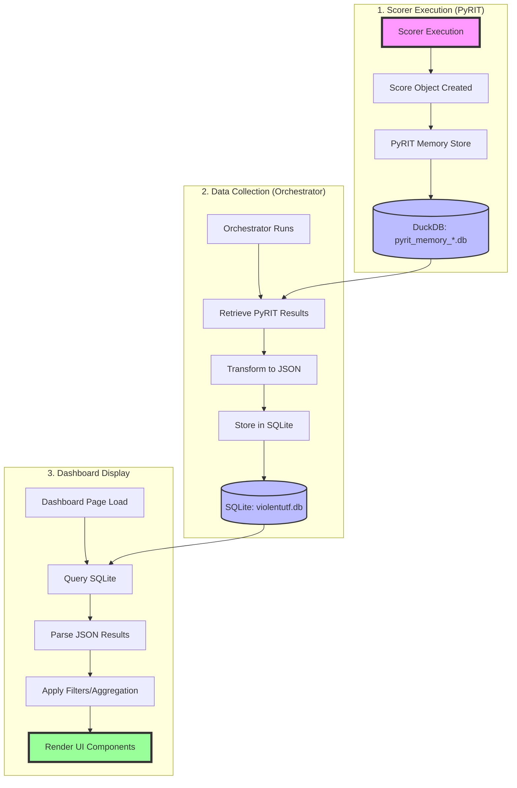

# Scorer Result Data Flow Diagram

## Overview
This diagram illustrates the complete data flow of scorer results from execution to display in the ViolentUTF Dashboard.



## Detailed Data Transformations

### Stage 1: PyRIT Scorer Results
```python
# Original scorer result structure
{
    "score_value": True/False/Float/String,
    "score_category": "category_name",
    "score_rationale": "explanation text",
    "score_metadata": {
        "scorer_type": "SubStringScorer",
        "timestamp": "2024-01-01T12:00:00Z",
        "prompt_id": "uuid-here"
    }
}
```

### Stage 2: Orchestrator Storage
```python
# Transformed structure in SQLite
{
    "execution_id": "uuid",
    "results": {
        "scores": [
            {
                "score_value": "transformed_value",
                "score_category": "category",
                "score_rationale": "rationale",
                "scorer_class_name": "SubStringScorer",
                "score_metadata": {...}
            }
        ],
        "prompt_request_responses": [
            {
                "request": {"prompt": "..."},
                "response": {"content": "..."}
            }
        ]
    }
}
```

### Stage 3: Dashboard Display
```python
# Display transformation
{
    "batch_id": "extracted_from_execution_name",
    "score_type": "mapped_from_scorer_class",
    "evaluation_result": "formatted_score_value",
    "prompt": "extracted_from_request",
    "response": "extracted_from_response",
    "timestamp": "formatted_datetime"
}
```

## Potential Inconsistency Points

### 🔴 Critical Transformation Points

1. **PyRIT → Orchestrator Transfer**
   - Async timing issues
   - Incomplete result retrieval
   - Memory database connection problems

2. **JSON Serialization**
   - Type conversion errors
   - Unicode handling issues
   - Large text truncation

3. **SQLite Storage**
   - JSON field size limits
   - Concurrent write conflicts
   - Transaction rollback issues

4. **Dashboard Query Logic**
   - Incorrect JOIN conditions
   - Filter logic errors
   - Aggregation mistakes

5. **Display Formatting**
   - Type casting errors
   - Missing null checks
   - Timezone conversions

### 🟡 Data Loss Risks

| Stage | Risk | Impact |
|-------|------|--------|
| PyRIT Memory | Temporary DB deletion | Complete data loss |
| Orchestrator Collection | Partial result fetch | Missing scores |
| JSON Transform | Field omission | Incomplete display |
| Dashboard Filter | Over-filtering | Hidden results |

### 🟢 Validation Checkpoints

1. **Checkpoint 1**: After PyRIT execution
   - Verify all scorers completed
   - Check DuckDB for results

2. **Checkpoint 2**: After orchestrator collection
   - Compare PyRIT vs SQLite counts
   - Validate JSON structure

3. **Checkpoint 3**: Before Dashboard display
   - Verify query results
   - Check transformation logic

4. **Checkpoint 4**: After UI rendering
   - Compare displayed vs queried data
   - Validate user-reported issues

## Investigation Priority Matrix

| Component | Likelihood of Issues | Impact | Priority |
|-----------|---------------------|---------|----------|
| Score Value Transformation | High | High | P0 |
| Prompt/Response Matching | High | Medium | P1 |
| Batch Identification | Medium | High | P1 |
| Timestamp Handling | Medium | Low | P2 |
| Metadata Preservation | Low | Low | P3 |

## Quick Diagnostic Queries

```sql
-- Check for orphaned scores (scores without responses)
SELECT COUNT(*) FROM orchestrator_executions
WHERE json_extract(results, '$.scores') IS NOT NULL
AND json_extract(results, '$.prompt_request_responses') IS NULL;

-- Check for malformed JSON
SELECT id, execution_name FROM orchestrator_executions
WHERE results IS NOT NULL
AND json_valid(results) = 0;

-- Compare score counts
SELECT
    execution_name,
    json_array_length(json_extract(results, '$.scores')) as score_count,
    json_array_length(json_extract(results, '$.prompt_request_responses')) as response_count
FROM orchestrator_executions
WHERE results IS NOT NULL;
```
